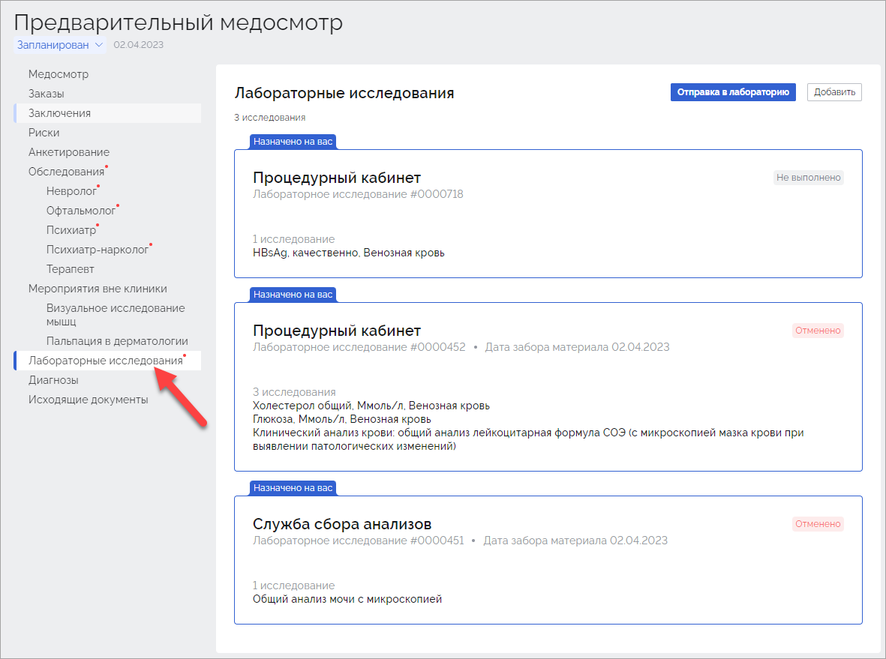
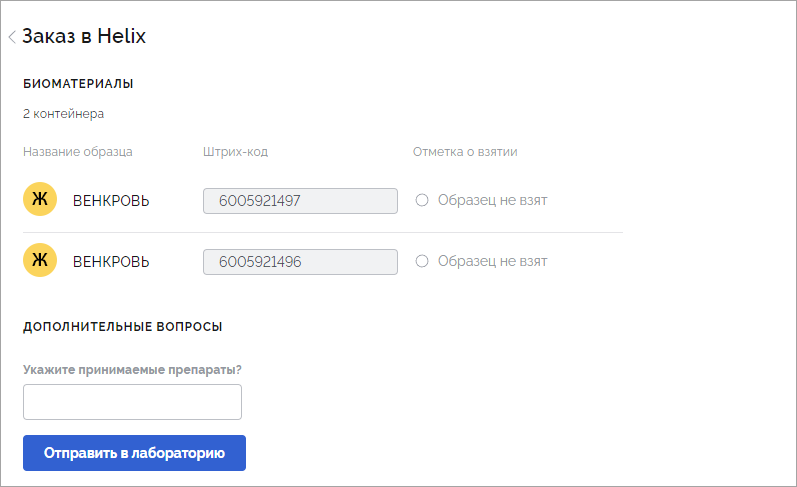
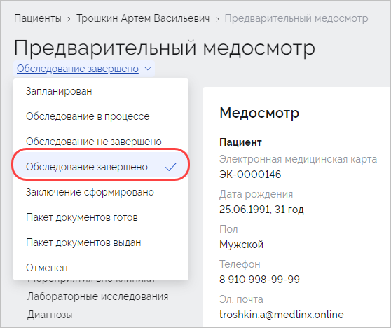

## Термины и определения

| Термин                    | Определение                                                  |
| ------------------------- | ------------------------------------------------------------ |
| Контрагент                | Юридическое лицо которое заключает договор на проведение медицинских осмотров с организациями |
| Организация               | Юридическое лицо которое направляет своих сотрудников на прохождение медицинских осмотров |
| Подразделение организации | Часть компании, осуществляющая свою деятельность в рамках деятельности всей компании. Как правило подразделение формируется формируется для реализации конкретного направления хозяйственной деятельности компании. Например: отдел управления проектами, отдел разработки, административно-хозяйственный отдел. |
| Локация                   | Часть организации, осуществляющая свою деятельность за пределами местонахождения головного офиса. |
| Сотрудник                 | Работник организации которому предстоит пройти медицинский осмотр. |

## 1. Общая информация

В системе существует несколько ролей пользователей. В зависимости от роли пользователю доступны определенные функциональные возможности системы. Роли пользователей системы:

1. Менеджер клиники. Добавляет и группирует сотрудников. Формирует план медицинского осмотра. Отчеты перед работодателем.
2. Администратор клиники (работник регистратуры). Работает с расписанием. Записывает пациентов на определенные даты и время. Печатает обходной лист. Добавляет документы пациента. 
3. Врач. Выполняет прием пациента. Заполняет данные осмотра, ставит диагноз, подписывает протокол.
4. Профпатолог (может быть как отдельной ролью, так и совмещен с врачом). Знакомится с результатами обследования сотрудника, результатами лабораторных исследований, заполняет параметры для расчета рисков, формировать заключение.

Ниже представлен порядок действий каждого специалиста при работе с системой.

## 2. Авторизация

Для авторизации перейдите по адресу системы Интегра. В открывшемся окне нажмите кнопку **Войти**:

В открывшемся окне введите логин и пароль пользователя:

Отобразится интерфейс системы.

## 3. Настройка системы

Первичная настройка системы предполагает контрагентов, организаций, договоров, счетов, контактной информации ответственных лиц.

### 3.1. Настройка контрагента

Для добавления контрагента перейдите в раздел **Контрагенты** (1) и нажмите кнопку **Создать** (2):

В окне **Новый контрагент** заполните требуемые поля и нажмите **Сохранить**:

Отобразится окно созданного контрагента в котором станет доступна возможность добавления организации. Каждый контрагент может включать в себя множество организаций. 

Для каждого контрагента существует возможность добавления договоров с организациями (1), счетов (2) и контактных данных ответственных лиц (3):

В разделе **Договоры** заключаются между клиниками и  контрагентами. В разделе **Счета** отображаются документы, подтверждающие факт оплаты услуг контрагентом клинике. В разделе контакты добавьте:

- Контактную информацию менеджера контрагента (1). 
- Контактную информацию ответственного за работу с контрагентом сотрудников клиники (2):

Для изменения данных контрагента или его удаления нажмите на значок в виде карандаша:

В открывшемся окне внесите необходимые изменения и нажмите **Сохранить**:

#### 3.1.1. Добавление договора

Раздел в разработке

#### 3.1.2. Добавления счетов

Раздел в разработке

#### 3.1.3. Добавление контактных данных ответственных лиц контрагента

Раздел в разработке

### 3.2. Настройка организации

Для привязки новой организации к контрагенту перейдите в раздел **Контрагенты**, выберите требуемого контрагента и в блоке **Организации** нажмите кнопку **Создать**:

Откроется окно **Новая организация**. Заполните требуемые поля и нажмите кнопку **Создать**:

Созданная организация отобразится в блоке **Организации** ранее выбранного контрагента:

Для каждой организации существует возможность добавления подразделения (1), локации (2) и контактных данных ответственных лиц (3):

Для изменения данных организации или её удаления нажмите значок в виде карандаша:

В открывшемся окне внесите необходимые изменения и нажмите **Сохранить**:

#### 3.2.1. Добавление подразделения

Раздел в разработке

#### 3.2.2. Добавление локации

Раздел в разработке

#### 3.2.3. Добавление контактных данных ответственных лиц  организации

Раздел в разработке

### 3.3. Настройка медосмотров

В системе доступны 3 вида медосмотров: предварительный, периодический и внеочередной. Настройка медосмотра представляет собой заполнение и передачу в медицинское учреждение файла с данными сотрудников организации, которым требуется пройти медицинский осмотр. Данные сотрудников формируются в файле формата [*.xlsx].

Настройка каждого из вида медосмотров выполняется для конкретной организации либо из окна контрагента либо из окна организации. Для настройки медосмотра:

Способ 1. В разделе **Контрагенты** кликните по записи требуемого контрагента. В открывшейся карточке контрагента в блоке **Организации** под записью каждой организации будут расположены строки с медосмотрами (1). Кликните либо по строке медосмотра (2) либо по ссылке **Планирование** (3):

Способ 2. В разделе **Контрагенты** кликните по записи требуемого контрагента. В открывшемся окне в блоке **Организации** кликните по требуемой организации. В открывшейся карточке организации будет доступен блок **Медосмотры** (1). Кликните либо по строке медосмотра (2) либо по ссылке **Планирование** (3):

Для загрузки файла со сотрудников по конкретному медосмотру нажмите кнопку **Загрузить**:

Откроется окно **Загрузка медосмотров**. Кликните по ссылке **Выберите файлы…** либо перетащите файл в строку (1). В случае отсутствия файла со списком сотрудников кликните по ссылке **по шаблону** (2). Будет скачан шаблон файла который требуется заполнить и загрузить в систему.

При наличии в загружаемом файле каких либо ошибок откроется окно с пояснениями. Исправьте ошибки в указанных ячейках и нажмите кнопку **Загрузить новый**:

Для новых сотрудников будут созданы электронные медицинские карты. Если у сотрудника уже есть электронная медицинская карта (например, ранее сотрудник уже посещал данное медицинское учреждение) в ней будут обновлены данные. Данные сопоставляются по Ф.И.О., дате рождения и телефону сотрудника. 

В случае отсутствия ошибок данные сотрудников будут добавлены в ранее выбранный тип медосмотра:

#### 3.3.1. Планирование медосмотров

Раздел с планируемыми медосмотрами предназначен для формирования списка медосмотров с определенными периодами прохождения, из которых в дальнейшем сотрудник может выбрать удобные для себя даты записи на медицинский осмотр. Например, при отправке большого количества сотрудников на медицинский осмотр в еще не определенную дату.

Для планирования медосмотра выделите записи требуемых сотрудников и в отобразившейся вверху панели нажмите кнопку **Начало медосмотра**:

Откроется окно **Начало медосмотра**. Выберите пункт **Период начала** (1), укажите дату начала и дату завершения медосмотра (2), нажмите кнопку **Сохранить** (3):

Либо установите значение **Без даты**. Тогда сотруднику для выбора будет доступна совершенно любая дата, не ограниченная определенным периодом:

Статус медосмотров ранее выбранных сотрудников изменится на "Запланирован":

Запланированный но еще не начатый медосмотр не будет добавлен в расписание.

#### 3.3.2. Начало медосмотров

Если требуется начать медосмотр в данный момент, выделите записи требуемых сотрудников и в отобразившейся панели нажмите кнопку **Начать**:

В открывшемся окне **Начать медосмотр** нажмите кнопку **Начать**:

На электронную почту ранее выбранных сотрудников будет отправлена анкета. Записи сотрудников будут перемещены в раздел **Активные**:

Для начала прохождения медосмотра сотрудник должен заполнить направленную ему анкету, выбрать время для записи и в выбранное им время явиться в клинику. Для заполнения анкеты и выбора времени приема требуется перейти по ссылке, прикрепленной во входящем письме:

В открывшемся окне онлайн-анкеты требуется:

1. Пройти анкетирование (1);
2. Выбрать время для записи на прием (2);
3. Ознакомиться с перечнем документов, необходимых для прохождения медосмотра (3);
4. Ознакомиться с правилами подготовки к анализам (4):

После прохождения анкетирования и выбора времени для записи, отобразится следующая информация:

На почту сотрудника поступит уведомление о записи на медицинский осмотр:

Далее сотруднику требуется явиться в указанное время в поликлинику, взяв с собой все требуемые документы и соблюдая правила подготовки к анализам. 

В случае невозможности заполнения сотрудником анкеты и/или выбора времени медосмотра можно будет записаться на медосмотр в регистратуре и заполнить анкету прямо в поликлинике. 

## 4. Действия администратора перед началом медицинского осмотра

После получения и заполнения сотрудником онлайн-анкеты, ему требуется явиться в удобное время в клинику для прохождения медосмотра. В клинике сотруднику необходимо обратиться к работнику регистратуры, который увидит профиль сотрудника в медосмотрах. 

В случае, если сотрудник не заполнял анкету и не выбирал время медосмотра, перейдите в раздел **Пациенты** (1), в поле **Поиск** (2) введите Ф.И.О. данного пациента и откройте его электронную медицинскую карту  (3):

В открывшейся электронной медицинской карте пациента кликните по названию запланированного медосмотра:

Откроется карточка медосмотра. Внизу карточки медосмотра в блоке **Документы** распечатайте все требуемые документы и передайте их на заполнение сотруднику. Существует возможность печати как сразу всех документов (кнопка **Все документы**) так и отдельных документов (значок в виде принтера справа от наименования документа):

Сотрудник должен ознакомиться с переданными ему документами, подписать их и передать работнику регистратуры. 

После получения от сотрудника подписанных документов измените статус медосмотра с "Запланирован" на "Обследование в процессе":

Сотрудник, руководствуясь данными из маршрутного листа, должен начать прохождение необходимых специалистов в удобном для него порядке:

## 5. Действия врача

### 5.1. Обследование врачами

Каждый врач к которому был направлен сотрудник должен выполнить следующие действия:

1. Найти карточку сотрудника по Ф.И.О. либо QR-коду (опционально, в случае наличия у врача сканера).
2. Перейти в раздел медицинской карты сотрудника, который соответствует специализации врача.
3. Выполнить осмотр сотрудника, заполнить и подписать протокол осмотра.

Для открытия карты медицинского осмотра сотрудника перейдите в раздел **Медосмотры** (1), в строке поиска введите Ф.И.О. пациента (2) и кликните по записи с Ф.И.О. пациента (3):

Откроется карточка медосмотра пациента. Выберите свою специализацию:

В открывшемся разделе карточки медосмотра сотрудника в строке **Протокол** нажмите ссылку **Заполнить**:

Будет открыт протокол приема:

Проведите осмотр сотрудника и заполните протокол. Некоторые поля обязательны к заполнению. В нижней части протокола осмотра доступна возможность постановки диагноза и указания противопоказаний. Для сохранения внесенных изменений нажмите кнопку **Сохранить**. Заполните все возможные данные и нажмите кнопку **Подписать**:

Протокол осмотра конкретным врачом будет сохранен и доступен для ознакомления профпатологу. Статус осмотра будет изменен на "Завершен".

Сотруднику необходимо завершить осмотр другими врачами а также пройти определенный объем лабораторных исследований.

### 5.2. Лабораторные исследования

Для лабораторных исследований сотруднику требуется предоставить определенный объем биоматериалов. Информация о том, какие исследования требуется выполнить для сотрудника доступны процедурным медсестрам.

Для открытия медицинской карты сотрудника перейдите в раздел **Медосмотры** (1), в строке поиска введите Ф.И.О. пациента (2). Кликните по записи с Ф.И.О. пациента (3):

В открывшемся окне карточки медосмотра перейдите в раздел **Лабораторные исследования**:

В зависимости от ранее заполненной анкеты или протоколов специалистов отобразится список исследований. Количество и типы исследований зависят от пола сотрудника, факторов и видов его деятельности. Также существует возможность ручного добавления исследований врачом.

Кликните по исследованию, ознакомьтесь с видами исследований и нажмите **Начать сбор биоматериалов**:

Для подтверждения начала сбора биоматериалов в всплывающем окне нажмите кнопку **Начать**:

Будет выполнена преаналитика и отобразится список необходимых лабораторных исследований а также список контейнеров со штрихкодами:

Возьмите у пациента требуемые образцы биоматериалов, поместите их в контейнеры с соответствующими штрихкодами и установите отметку о взятии(1). В случае необходимости укажите ответы на дополнительные вопросы (2) и нажмите кнопку **Отправить в лабораторию** (3):

В случае невозможности взятия конкретного образца биоматериала (например, сотрудник не соблюдал диету перед медицинским осмотром) не устанавливайте отметку **Образец не взят**. 

Заказ будет сформирован и отправлен в лабораторию: 

В карточке медицинского осмотра статус лабораторного исследования изменится на "В лаборатории":

После выполнения лабораторных исследований биоматериалов сотрудника, результаты будут автоматически добавлены в систему и будут доступны профпатологу для ознакомления.

### 5.3. Мероприятия вне клиники

Работнику регистратуры доступна возможность добавления в карточку медосмотра результатов исследований или заключений специалистов, которые уже имеются у сотрудника (например, результаты прохождения рентгенологического исследования) либо направления сотрудника на дополнительное обследование в другую клинику. Для этого перейдите в раздел **Мероприятия вне клиники** (1) и нажмите кнопку **Добавить** (2):

В открывшемся окне **Новое мероприятие** выберите тип услуги (1), укажите либо измените название (2) и нажмите кнопку **Создать** (3). В данном случае мероприятие будет создано и сохранено. Либо сразу нажмите кнопку **Запланировать** для формирования приема (4):

Отобразится запланированное и./или сформированное мероприятие:

Перейдите в запланированное мероприятие и сформируйте направление. Для этого кликните на запись с требуемым мероприятием:

В открывшемся окне запланированного мероприятия кликните на запись с направлением либо нажмите ссылку **Заполнить** справа от него:

Заполните направление и нажмите кнопку **Сохранить**:

Направление будет сформировано и отобразится в разделе мероприятий. Распечатайте направление и передайте сотруднику:

После прохождения сотрудником запланированных мероприятий и предоставления результатов загрузите их в карточку мероприятия. Для этого кликните по строке **Результаты** либо по ссылке **Загрузить**:

В открывшемся окне укажите путь к файлу с результатами выполненного мероприятия либо перетащите его в данное поле (1), укажите дату прохождения мероприятия сотрудником (2) и нажмите кнопку **Сохранить** (3):

Карточка ранее назначенного мероприятия вне клиники примет соответствующий вид:

## 6. Действия администратора при завершении медицинского осмотра

После прохождения сотрудником осмотров врачей в соответствии с маршрутным листом, завершения функциональных и лабораторных исследований требуется изменить статус карточки медицинского осмотра на "Обследование завершено". Для этого перейдите в раздел **Медосмотры** (1), в строке поиска введите Ф.И.О. сотрудника (2). Кликните по записи с Ф.И.О. пациента (3):

Откроется карточка медосмотра сотрудника. В левой верхней части карточки медицинского осмотра измените статус с "Обследование в процессе" на "Обследование завершено":

В случае, если сотрудник не успел выполнить все обследования врачами или сдать биоматериал для выполнения требуемых лабораторных исследований, установите статус "Обследование не завершено". Медицинский осмотр можно будет возобновить в дальнейшем, изменив статус медицинского осмотра с "Обследование не завершено" на "Обследование в процессе".

В конце рабочего дня работнику регистратуры рекомендуется проверять все статусы медицинских осмотров для ручного завершения открытых медицинских осмотров либо связи с работодателем сотрудника. Например, в случае завершения сотрудником всех врачебных обследований, лабораторных обследований и осмотров врачей но не обратившегося в регистратуру (Ситуация, когда сотрудник выполнил все обследования и покинул клинику без обращения в регистратуру).

## 7. Действия профпатолога

После завершения медицинского осмотра сотрудником, профпатологу необходимо ознакомиться с его карточкой медицинского осмотра. Задача профпатолога изучить результаты обследования сотрудника специалистами и лабораторных исследований, заполнить параметры для расчета рисков, сформировать заключение.

### 7.1. Расчет рисков

Для расчета рисков  перейдите в раздел **Медосмотры**.  В списке медосмотров найдите  медосмотр сотрудника со статусом "Обследование завершено". Для удобства поиска в строке фильтров для фильтра **Статус** установите значение "Обследование завершено":

Кликните по записи с требуемым медосмотром. Откроется карточка медосмотра. Перейдите на вкладку **Риски**:

Кликните по ссылке **Заполнить** для указания параметров для расчета рисков:

Откроется окно **Параметры для расчета**. Заполните все поля отмеченные красной звездочкой. Некоторые поля будут заполнены автоматически данными из протокола осмотра сотрудника врачом-терапевтом. Нажмите кнопку **Рассчитать риски**:

Будут рассчитаны риски и сформированы результаты:

### 7.2. Формирование заключения 

Для формирования заключения к медицинскому осмотру сотрудника перейдите в раздел **Медосмотры**.  В списке медосмотров найдите нужный медосмотр со статусом "Обследование завершено". Для удобства поиска в строке фильтров для фильтра **Статус** установите значение "Обследование завершено":

Кликните по записи с требуемым медосмотром. Откроется карточка медосмотра. Перейдите на вкладку **Заключение профпатолога** и нажмите кнопку **Создать**:

В окне **Заключение профпатолога** выполните следующие действия:

1. В случае наличия у сотрудника противопоказаний к работе укажите их в строке **Противопоказания** (1). Выберите вариант "Есть противопоказания" или "Нет противопоказаний". Укажите факторы риска к которым относятся данные противопоказания а также укажите группу здоровья.

   

2. Укажите комментарии в поле **Примечание** (2).

3. Укажите дату формирования заключения (3).

4. В случае установленных диагнозов кликните по ссылке **Добавить..** и выберите необходимые диагнозы (4).

5. Заполните статистическую информацию: нуждается ли сотрудник в амбулаторном, стационарном санаторно-курортном обследовании и лечении или в диспансерном наблюдении:

После заполнения всех необходимых полей нажмите кнопку **Сохранить**. Будет сформирован и сохранен черновик заключения профпатолога:

При возникновении необходимости внести изменения в заключение профпатолога в правом верхнем углу нажмите на значок в виде трех точек и выберите вариант **Редактировать** (1). Для удаления текущего варианта заключения нажмите **Удалить** (2):

Подпишите заключение.  Для этого нажмите кнопку **Подписать**:

Подтвердите подписание:

И измените статус медосмотра на "Заключение сформировано":

## 8. Действия администратора после формирования заключения профпатологом

После формирования профпатологом заключения по медицинскому осмотру сотрудника требуется подготовить и передать сотруднику пакет документов. Для этого перейдите в раздел **Медосмотры** (1), в строке поиска введите Ф.И.О. пациента (2). Кликните по записи с Ф.И.О. сотрудника (3):

Откроется карточка медосмотра сотрудника. Перейдите в раздел **Исходящие документы** (1) и распечатайте все доступные документы (2):

В случае, если в вашем медицинском учреждении есть договоренность с работодателем сотрудника о передачи всех документов непосредственно сотруднику, передайте их сотруднику и измените статус медицинского осмотра на "Пакет документов выдан":

В случае отсутствия такой договоренности весь пакет документов доставляется работодателю силами медицинского учреждения. В данном случае сотрудники медицинского учреждения  выполняются поиск медосмотров сотрудников с готовыми заключениями, печатают данные заключения, подписывают, ставят печати, собирают пакет и передают работодателю сотрудников. 

На данном этапе работе с сотрудником закончена. В зависимости от требований медицинского учреждения после медосмотра или в конце календарного года требуется сформировать заключительные акты по организациям.

## 9. Формирование заключительных актов

В задачи профпатолога входит формирование заключительных актов по завершенным периодическим медосмотрам.

Для формирования заключительных актов перейдите в раздел **Контрагенты** (1) и кликните по записи требуемого контрагента (2):

В открывшемся окне откройте под нужной организацией кликните по записи с периодическим медосмотром:

В открывшемся окне выберите сотрудников завершивших медосмотр и сформируйте заключительный акт. 
