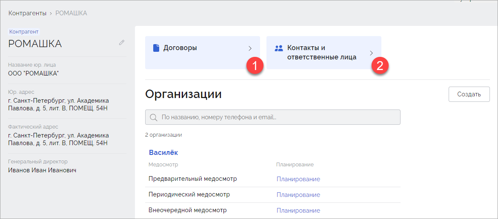
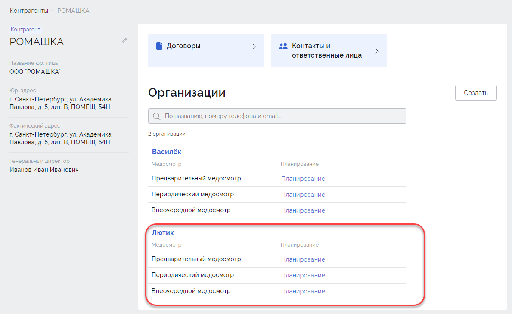
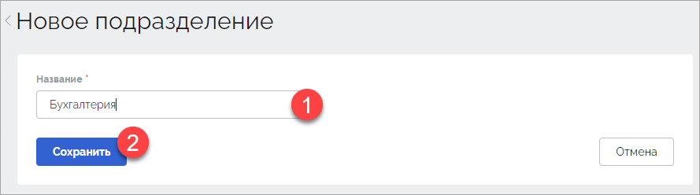
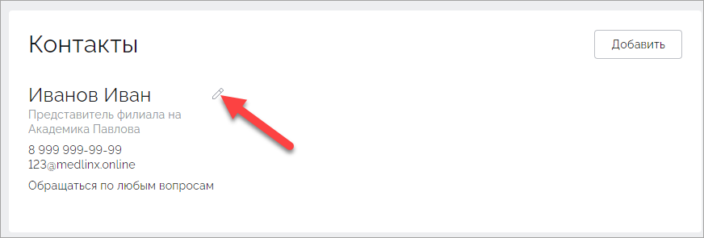
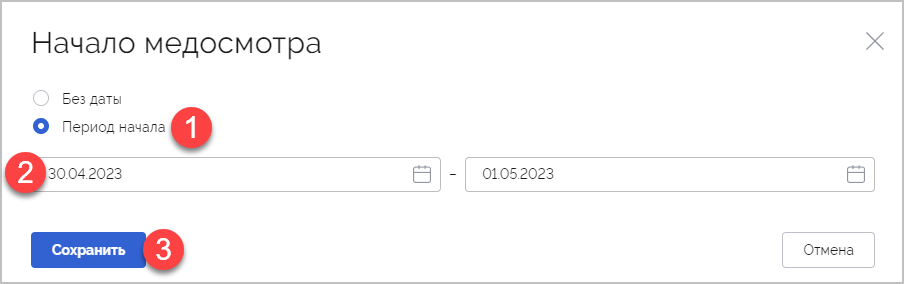
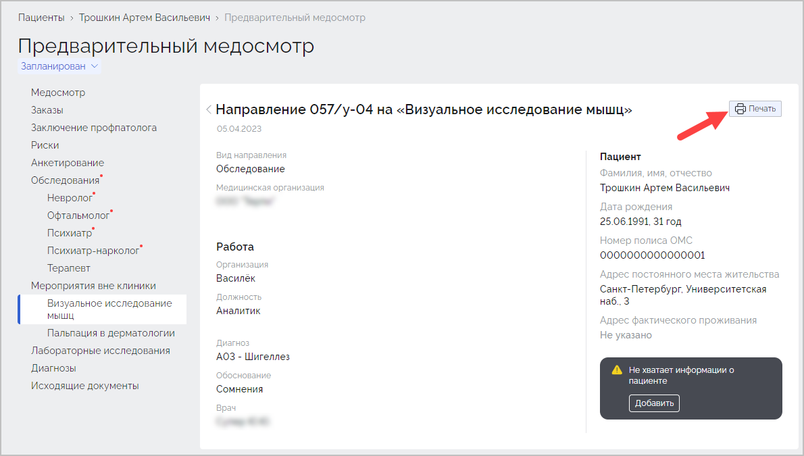
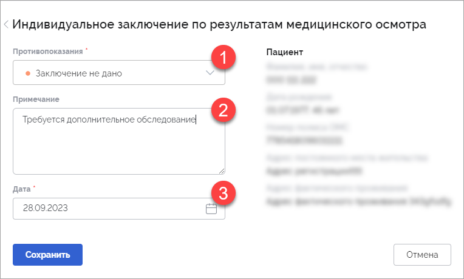
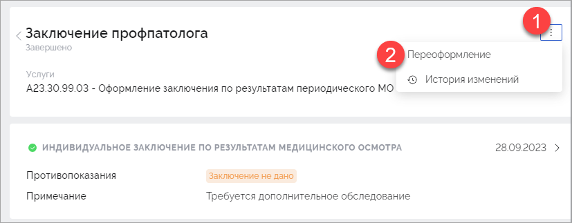
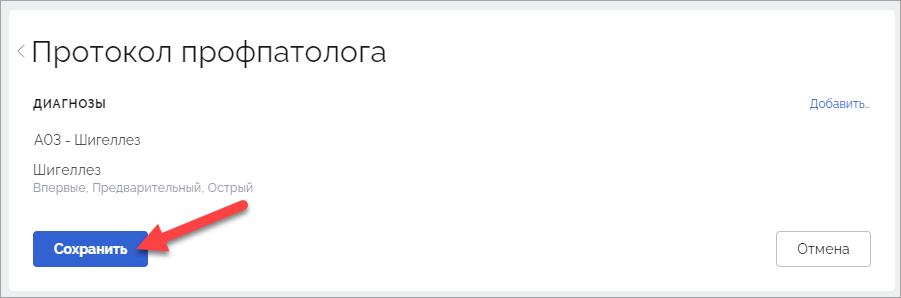

## Термины и определения

| Термин                    | Определение                                                  |
| ------------------------- | ------------------------------------------------------------ |
| Контрагент                | Юридическое лицо, которое заключает договор на проведение медицинских осмотров с организациями |
| Организация               | Юридическое лицо, которое направляет своих сотрудников на прохождение медицинских осмотров |
| Подразделение организации | Часть компании, осуществляющая свою деятельность в рамках деятельности всей компании. Как правило подразделение формируется для реализации конкретного направления хозяйственной деятельности компании. Например, отдел управления проектами, отдел разработки, административно-хозяйственный отдел. |
| Локация                   | Часть организации, осуществляющая свою деятельность за пределами местонахождения головного офиса. |
| Пациент                   | Сотрудник организации (работник), которому предстоит пройти медицинский осмотр. |

## Содержание

[TOC]

## 1. Общая информация

В системе существует несколько ролей пользователей. В зависимости от роли пользователю доступны определенные функциональные возможности системы. Роли пользователей системы:

1. Администратор: управляет работой клиники, работает с учетными записями сотрудников клиники, кабинетами.
1. Менеджер клиники: добавляет и группирует пациентов, формирует план медицинского осмотра, готовит отчеты перед работодателем.
2. Работник регистратуры: работает с расписанием, записывает пациентов на определенные даты и время, печатает обходной лист, добавляет документы пациента. 
3. Врач (сотрудник клиники): выполняет прием пациента, заполняет данные осмотра, ставит диагноз, подписывает протокол.
4. Профпатолог (может быть как отдельной ролью, так и совмещенной с врачом): знакомится с результатами обследования пациента, результатами лабораторных исследований, заполняет параметры для расчета рисков, формирует заключение.

Ниже представлен порядок действий каждого специалиста при работе с системой.

## 2. Авторизация

Для авторизации перейдите по адресу системы Интегра. В открывшемся окне нажмите кнопку **Войти**:

В открывшемся окне введите логин и пароль пользователя:

Отобразится интерфейс системы.

## 3. Настройка системы

Первичная настройка системы предполагает добавление контрагентов, организаций, договоров, счетов, контактной информации ответственных лиц.

### 3.1. Настройка контрагента

Настройка контрагента выполняется пользователем с ролью "Менеджер".

Для добавления контрагента перейдите в раздел **Контрагенты** (1) и нажмите кнопку **Создать** (2):

В окне **Новый контрагент** заполните требуемые поля и нажмите **Сохранить**:

Отобразится окно созданного контрагента, в котором станет доступна возможность добавления организации. Каждый контрагент может включать в себя множество организаций.

Для контрагента существует возможность добавления договоров с организациями (1) и контактных данных ответственных лиц (2):

В разделе **Договоры** содержатся договоры, заключенные между клиниками и  контрагентами. В раздел **Контакты** добавьте:

- контактную информацию менеджера контрагента (1);
- контактную информацию ответственного за работу с контрагентом сотрудников клиники (2):

Для изменения данных контрагента или его удаления нажмите на значок в виде карандаша:

В открывшемся окне внесите необходимые изменения и нажмите **Сохранить**:

#### 3.1.1. Добавление договора

Для добавления договора в карточке контрагента нажмите кнопку **Договоры**:

В открывшемся окне нажмите кнопку **Создать**:

Откроется окно **Новый договор**. Укажите номер договора (1), дату начала его действия (2), если требуется использовать данный договор по умолчанию для прикрепления всех новых загружаемых пациентов - установите соответствующий признак (3) и нажмите кнопку **Создать** (4):

Будет создан новый договор:

Для нового договора будут добавлены все существующие услуги по стандартной цене. В случае необходимости указания цен услуг отличных от заданных по умолчанию нажмите на значок справа от прайс-листа:

Откроется прайс-лист. В колонке **Цена** измените значения стоимости услуги на требуемые:

Внесенные изменения будут сохранены автоматически.

В случае возникновения необходимости расчета индивидуального коммерческого предложения для контрагента, итоговая стоимость которого должна соответствовать запланированному бюджету, воспользуйтесь калькулятором предполагаемой сметы по договору. Данная возможность позволяет в режиме реального времени рассчитывать стоимость проведения всех медосмотров в рамках договора, а также сохранять подобранные цены на услуги в прайс-лист договора. В разделе **Договоры** нажмите кнопку **Рассчитать услуги**:

Откроется окно **Расчет услуг**, включающее перечень услуг, количество сотрудников и стоимость услуги. Если услуга из перечня добавлена в прайс-лист клиники или договора, то её стоимость будет взята оттуда. В ином случае стоимость услуги будет равна нулю и требуется указать её вручную. Укажите специальные цены для требуемых услуг (1), соответствующие планируемому бюджету (2) и нажмите кнопку **Применить цены**:

Стоимость измененных услуг сохранится в прайс-листе договора. После применения цен карточка договора будет содержать как количество услуг по стандартной цене, так и количество услуг по специальной цене:

Далее добавьте реквизиты для оплаты (1) и требуемые документы (2):

#### 3.1.2. Добавление контактных данных ответственных лиц контрагента

В разделе **Контакты и ответственные лица** содержится справочная информация о контрагенте для работников. Для добавления подобной информации откройте карточку контрагента и перейдите в данный раздел:

 Откроется раздел **Контакты**, в котором будет доступна возможность добавления как контактных лиц контрагента (2), так и ответственных лиц со стороны клиники (2):

Для добавления контактных лиц контрагента в блоке **Контакты** нажмите кнопку **Добавить**:

Откроется форма добавления нового контакта. Заполните требуемые поля и нажмите кнопку **Сохранить**:

Добавленные данные отобразятся в разделе **Контакты**:

Ответственными лицами будут являться представители клиники, взаимодействующие с данным контрагентом. Для добавления ответственных лиц со стороны клиники в соответствующем блоке кликните по ссылке **Выбрать**, расположенной рядом с требуемой ролью:

Откроется окно с выбранной ролью, содержащее список специалистов. Выберите требуемого специалиста из списка или воспользуйтесь строкой поиска. Нажмите кнопку **Сохранить**:

Выбранный специалист будет добавлен в блок **Ответственные лица со стороны клиники**:

### 3.2. Настройка организации

Настройка организации выполняется пользователем с ролью "Менеджер".

Для привязки новой организации к контрагенту перейдите в раздел **Контрагенты**, выберите требуемого контрагента и в блоке **Организации** нажмите кнопку **Создать**:

Откроется окно **Новая организация**. Заполните требуемые поля и нажмите кнопку **Создать**:

Созданная организация отобразится в блоке **Организации** ранее выбранного контрагента:

Для каждой организации существует возможность добавления подразделения (1), локации (2) и контактных данных ответственных лиц (3):

Для изменения данных организации или её удаления нажмите значок в виде карандаша:

В открывшемся окне внесите необходимые изменения и нажмите **Сохранить**:

#### 3.2.1. Добавление подразделения

Подразделением называется часть организационной структуры компании. Например: бухгалтерия, водители. Подразделение как часть организации фигурирует в медосмотрах. Для добавления нового подразделения в карточке организации нажмите кнопку **Подразделения**:

Откроется окно **Подразделения**. Нажмите кнопку **Создать**:

В открывшемся окне **Новое подразделение** укажите название подразделения (1) и нажмите кнопку **Сохранить** (2):

Добавленное подразделение отобразится на странице **Подразделения**:

Для изменения наименования подразделения справа от него нажмите на значок в виде карандаша. Для удаления подразделения нажмите на значок в виде корзины. Аналогичным способом добавьте все необходимые подразделения для организации.

#### 3.2.2. Добавление локации

Локацией называется часть организации с отдельным местоположением. Для добавления локации в карточке организации нажмите кнопку **Локации**:

В открывшемся окне **Локации** нажмите кнопку **Создать**:

Откроется окно **Новая локация**. Введите название локации (1) и адрес (2). Нажмите кнопку **Сохранить**:

Локация будет добавлена для организации:

Для изменения наименования или адреса локации справа от нее нажмите на значок в виде карандаша. Для удаления локации нажмите на значок в виде корзины. Аналогичным способом добавьте все необходимые локации для организации.

#### 3.2.3. Добавление контактных данных ответственных лиц  организации

Для каждой организации требуется добавить контактные данные представителей клиента для взаимодействия как с организацией в целом, так и с её локациями и подразделениями.

Для добавления контактных данных ответственных лиц организации в карточке организации нажмите на кнопку **Контакты и ответственные лица**:

В открывшемся окне **Контакты** нажмите кнопку **Добавить**:

Откроется окно **Новый контакт**. Заполните требуемые поля и нажмите кнопку **Сохранить**:

Данные контактного лица будут добавлены в раздел **Контакты** ранее выбранной организации:

Для изменения или удаления контактных данных нажмите значок в виде карандаша:

Откроется окно **Редактирование контакта**:

Для изменения данных контактного лица внесите изменения в требуемые поля и нажмите кнопку **Сохранить** (1). Для удаления контактного лица нажмите кнопку **Удалить** (2).

### 3.3. Настройка медосмотров

Настройка медосмотров выполняется пользователем с ролью "Менеджер".

В системе доступны 3 вида медосмотров: предварительный, периодический и внеочередной. Настройка медосмотра представляет собой заполнение и передачу в медицинское учреждение файла с данными пациентов, которым требуется пройти медицинский осмотр. Данные пациентов формируются в файле формата [*.xlsx].

Настройка каждого вида медосмотров выполняется для конкретной организации из окна контрагента или из окна организации. Для настройки медосмотра:

Способ 1. В разделе **Контрагенты** кликните по записи требуемого контрагента. В открывшейся карточке контрагента в блоке **Организации** под записью каждой организации будут расположены строки с медосмотрами (1). Кликните по строке медосмотра (2) или по ссылке **Планирование** (3):

Способ 2. В разделе **Контрагенты** кликните по записи требуемого контрагента. В открывшемся окне в блоке **Организации** кликните по требуемой организации. В открывшейся карточке организации будет доступен блок **Медосмотры** (1). Кликните по строке медосмотра (2) или по ссылке **Планирование** (3):

Для загрузки файла со списком пациентов по конкретному медосмотру нажмите кнопку **Загрузить**:

Откроется окно **Загрузка медосмотров**. Кликните по ссылке **Выберите файлы…** или перетащите файл в строку (1). В случае отсутствия файла со списком пациентов кликните по ссылке **По шаблону** (2). Будет скачан шаблон файла, который требуется заполнить и загрузить в систему:

При наличии в загружаемом файле ошибок откроется окно с пояснениями. Исправьте ошибки в указанных ячейках и нажмите кнопку **Загрузить новый**:

При успешной загрузке файла будет выполнена проверка посещений пациента. Проверка выполняется на основе указанных в файле значений. В случае, если:

- В файле указаны данные, включая номер ЭМК и СНИЛС пациента. Будет осуществлен поиск медицинской карты пациента по номеру ЭМК. Если карта найдена, данные пациента в ЭМК будут обновлены. Если карта не будет найдена, отобразится ошибка. Выполните проверку номера ЭМК в файле.
- В файле указаны данные за исключением СНИЛС. Выполняется проверки, аналогичные предыдущему пункту. Проверьте корректность номера ЭМК пациента в файле.
- В файле указаны данные за исключением номера ЭМК. Будет осуществлён поиск медицинской карты пациента по СНИЛС. Если СНИЛС будет найден, выполнится проверка соответствия Ф.И.О. и даты рождения в ЭМК аналогичным данным из файла. Если найти СНИЛС не получится, проверка соответствия Ф.И.О. и даты рождения в ЭМК и файле будет пропущена.
- В файле указаны данные за исключением номера ЭМК и СНИЛС. Будет выполнена проверка соответствия Ф.И.О., даты рождения и номера телефона в базе аналогичным данным в файле. Если соответствие будет найдено, отобразится ошибка. Укажите номер ЭМК пациента в файле. 

Если данные пациента отсутствуют в системе, будет создана новая ЭМК.

Данные пациентов будут добавлены в ранее выбранный тип медосмотра:

#### 3.3.1. Планирование медосмотров

Раздел с планируемыми медосмотрами предназначен для формирования списка медосмотров с определенными периодами прохождения, из которых в дальнейшем пациент может выбрать удобные для себя даты записи на медицинский осмотр. Например, при отправке большого количества пациентов на медицинский осмотр в еще не определенную дату.

Для планирования медосмотра выделите записи требуемых пациентов и в отобразившейся вверху панели нажмите кнопку **Начало медосмотра**:

Откроется окно **Начало медосмотра**. Выберите пункт **Период начала** (1), укажите дату начала и дату завершения медосмотра (2), нажмите кнопку **Сохранить** (3) или установите значение **Без даты**. Тогда пациенту для выбора будет доступна совершенно любая дата, не ограниченная определенным периодом:

Статус медосмотров ранее выбранных пациентов изменится на "Запланирован":

Запланированный, но еще не начатый медосмотр не будет добавлен в расписание.

#### 3.3.2. Начало медосмотров

Если требуется начать медосмотр в данный момент, выделите записи требуемых пациентов и в отобразившейся панели нажмите кнопку **Начать**:

В открывшемся окне **Начать медосмотр** нажмите кнопку **Начать**:

На номер телефона и/или электронную почту ранее выбранных пациентов будет отправлена анкета. Записи пациентов будут перемещены в раздел **Активные**:

Для начала прохождения медосмотра пациент должен заполнить направленную ему анкету, выбрать время для записи и в выбранное им время явиться в клинику. В случае невозможности заполнения пациентом анкеты и/или выбора времени медосмотра можно будет записаться на медосмотр в регистратуре и заполнить анкету в поликлинике.

Для заполнения анкеты и выбора времени приема требуется перейти по ссылке, прикрепленной во входящем письме:

В открывшемся окне онлайн-анкеты требуется:

1. Пройти анкетирование (1).
2. Выбрать время для записи на прием (2).
3. Ознакомиться с перечнем документов, необходимых для прохождения медосмотра (3).
4. Ознакомиться с правилами подготовки к анализам (4):

После прохождения анкетирования и выбора времени для записи отобразится следующая информация:

На почту пациента поступит уведомление о записи на медицинский осмотр:

Далее пациенту требуется явиться в указанное время в поликлинику, имея с собой все требуемые документы.

#### 3.3.3. Формирование направлений

При направлении работодателем сотрудников на медицинский осмотр, каждому сотруднику формируется и выдается направление на медицинский осмотр. Направление формируется менеджером клиники после начала медосмотра. После получения от кадровой службы работодателя данных сотрудников в формате [*.xlsx], менеджер клиники загружает данные в систему и начинает медосмотр. После начала медосмотра становится доступной возможность формирования направления. 

Для формирования направления перейдите в раздел **Контрагенты**, выберите требуемую организацию и тип медосмотра. Перейдите на вкладку **Активные** (1) и выделите записи работников, для которых необходимо сформировать направление (2). Нажмите кнопку **Направления** (3):

Откроется файл направления, содержащий данные организации, наименование и адрес клиники, данные пациента и QR-код:

Скачайте файл направления и направьте сотруднику кадровой службы работодателя пациента. Сотрудник кадровой службы распечатает, подпишет и передаст пациенту данное направление. Пациент в назначенное время должен явиться в регистратуру клиники с данным направлением и паспортом. Сотрудник регистратуры выполнит сканирование QR-кода направления для нахождения медосмотра. После начала медосмотра QR-код из направления будет продублирован в обходном листе.

### 3.4. Настройка клиники

Настройка клиники выполняется пользователем с ролью "Администратор".

#### 3.4.1. Работа с учетными записями сотрудников клиники

Для создания новой учетной записи сотрудника клиники перейдите в раздел **Клиника** (1), откройте вкладку **Сотрудники** (2) и нажмите кнопку **Новый сотрудник** (3):

Откроется окно **Новый сотрудник**. Заполните данные нового сотрудника, придумайте пароль в соответствии с требованиями системы и нажмите кнопку **Создать**:

Будет сформирована карточка сотрудника клиники, содержащая личную информацию, роли и службы сотрудника. 

После создания карточки укажите роль и службу данного сотрудника в системе. Для указания роли в блоке **Роли** (1) нажмите кнопку **Задать роль** (2) либо нажмите на значок в виде карандаша (3):

Откроется окно **Редактирование ролей**. В соответствии в ролью сотрудника установите требуемый переключатель:

При выборе роли "Врач" отобразится поле **Специальность**. Воспользуйтесь поиском либо выберите необходимую специальность сотрудника из списка:

После выбора требуемых ролей сотрудника системы изменения будут сохранены автоматически. Передайте сотруднику клиники логин и пароль от учетной записи любым безопасным способом.

Для указания службы в блоке **Службы** (1) нажмите кнопку **Выбрать службу** (2) либо нажмите на значок в виде карандаша (3):

В открывшемся окне **Редактирование служб** кликните по значку для открытия выпадающие списка или введите название службы в строке поиска:

Установите требуемые службы и нажмите **Сохранить**:

Для редактирования или удаления данных сотрудника клиники перейдите в раздел **Клиника **(1) - **Сотрудники** (2) и в строке поиска введите Ф.И.О. нужного сотрудника клиники:

Для изменения личных данных сотрудника клиники (фамилия, имя, отчество, номер телефона, электронная почта) а также удаления данных кликните по значку в виде карандаша (1).

Для изменения пароля сотрудника клиники или роли кликните по записи сотрудника (2):

#### 3.4.2. Работа со службами клиники

Для работы  организационными службами медицинского учреждения в раздел **Клиника** перейдите на вкладку **Службы** и нажмите кнопку **Новая служба**:

В открывшемся окне укажите название новой службы (1), номера кабинетов где будет располагаться служба и нажмите кнопку **Создать** (3):

Новая служба будет создана и отобразится в разделе **Службы**. Для дальнейшего редактирования новой службы кликните по её карточке:

В открывшемся окне службы можно выполнить следующие дейтсвия:

- Изменить название и номера кабинетов службы (1);
- Выбрать услуги, оказываемые специалистами данной службы (2);
- Выбрать сотрудников, относящихся к данной службе (3):

Для добавления службе определенных услуг в блоке **Услуги** нажмите кнопку **Выбрать услуги**. В открывшемся окне установите чекбоксы рядом с требуемыми услугами. Услуги, уже используемые другими службами, отмечены комментарием "Услуга уже оказывается службой …". После выбора требуемых услуг для службы нажмите **Сохранить**:

Для добавления сотрудников которые будут относиться к данной службы в блоке **Сотрудники** нажмите **Выбрать сотрудников**. В открывшемся окне установите чекбоксы рядом с требуемыми сотрудниками. Для поиска конкретных сотрудников воспользуйтесь строкой поиска. После выбора сотрудников нажмите **Сохранить**:

#### 3.4.3. Работа с прайс-листами

Каждая клиника имеет список услуг с определенной стоимостью, которые она оказывает пациентам. Список всех услуг, оказываемой клиникой физическим лицам, и их стоимость доступны в разделе **Клиника — Прайс-лист**:

Для поиска конкретной услуги в строке поиска введите ее наименование или код.

В случае если клинике требуется установить постоянную цену на весь медицинский осмотр вне зависимости от типа и количества его услуг, в разделе **Прайс-лист** для всех типов заключений профпатолога установите необходимую стоимость медицинского осмотра, а для всех остальных услуг установите нулевую стоимость:

#### 3.4.4. Работа с услугами

Карточка каждой клиники содержит в себе реестр услуг, оказываемых данной клиникой. Для настройки реестра услуг клиники перейдите в раздел **Клиника - Услуги**:

Реестр содержит группы услуг (1) такие как приемы врачей, инструментальные и лабораторные исследования, оформление заключений. Каждая группа включает в себя определенный перечень услуг (2), включающий код услуги, название, название службы, выполняющую данную услугу и дополнительная информация. Для лабораторных исследований в качестве дополнительной информации отображается код услуги в лаборатории и выбранный биоматериал. Для приемов врачей и инструментальных исследований отображается название протокола, связанного с конкретной услугой.

Услуги сортируются по коду. Для поиска требуемой услуги воспользуйтесь стройкой поиска (3). 

Для редактирования услуги нажмите значок в виде карандаша в правой части записи услуги:

Услугам определенной группы доступны различные поля для редактирования. Для услуг группы "Лабораторные исследования" доступны для редактирования поля **Название** (1), **Служба** (2), **Код услуги в лаборатории** (3) и **Выбор биоматериалов** (4). Внесите необходимые изменения и нажмите кнопку **Сохранить** (5):

Аналогичным образом редактируются услуги других групп. Например, для услуг группы "Инструментальные исследования" и "Приемы врачей" для редактирования доступны поля **Название** и **Служба**:

## 4. Действия работника регистратуры перед началом медицинского осмотра

После получения и заполнения пациентом онлайн-анкеты ему требуется явиться в удобное время в клинику для прохождения медосмотра. В клинике пациенту необходимо обратиться к работнику регистратуры, который увидит профиль пациента в медосмотрах.

В случае, если пациент не заполнял анкету и не выбирал время медосмотра, перейдите в раздел **Пациенты** (1), в поле **Поиск** (2) введите Ф.И.О. пациента и откройте его электронную медицинскую карту (3):

В открывшейся электронной медицинской карте пациента кликните по названию запланированного медосмотра:

Откроется карточка медосмотра. Внизу карточки медосмотра в блоке **Документы** распечатайте все требуемые документы и передайте их на заполнение пациенту. Существует возможность печати как всех документов (кнопка **Все документы**), так и отдельных документов (значок в виде принтера справа от наименования документа):

В случае, если пациент ранее заполнял онлайн-анкету, она будет отсутствовать в списке документов и отобразится заполненной в разделе **Анкетирование**.

Пациент должен ознакомиться с переданными ему документами, подписать их и передать администратору.

Если пациент заполнял анкету непосредственно в клинике, зайдите в медосмотр пациента и загрузите туда запалённую анкету. Для этого перейдите в раздел **Анкетирование** (1) и в блоке **Результаты** нажмите **Загрузить** (2):

Откроется окно Результаты анкетирования. Укажите путь к файлу заполненной анкеты пациента или перетащите её в данное поле:

Нажмите кнопку **Сохранить**. Статус анкетирования изменится на "Выполнено". В блоке **Результаты** отобразится файл и дата загрузки анкеты:

После получения от пациента подписанных документов, измените статус медосмотра с "Запланирован" на "Обследование в процессе":

Пациент, руководствуясь данными из маршрутного листа, должен начать прохождение врачей в удобном для него порядке:

## 5. Действия врача

### 5.1. Обследование врачами

Каждый врач, к которому был направлен пациент, должен выполнить следующие действия:

1. Найти карточку пациента по Ф.И.О. или QR-коду из обходного листа пациента (в случае наличия у врача сканера).
2. Перейти в раздел медицинской карты пациента, который соответствует специализации врача.
3. Выполнить осмотр пациента, заполнить и подписать протокол осмотра.

Для открытия карты медицинского осмотра пациента перейдите в раздел **Медосмотры** (1), в строке поиска введите Ф.И.О. пациента (2) и кликните по записи с Ф.И.О. (3):

Откроется карточка медосмотра пациента. Выберите свою специализацию:

В открывшемся разделе карточки медосмотра пациента в строке **Протокол** нажмите ссылку **Заполнить**:

Будет открыт протокол приема:

Проведите осмотр пациента и заполните протокол. Некоторые поля обязательны к заполнению. В нижней части протокола осмотра доступна возможность постановки диагноза и указания противопоказаний. Для сохранения внесенных изменений нажмите кнопку **Сохранить**. Заполните все данные и нажмите кнопку **Подписать**:

Протокол осмотра конкретным врачом будет сохранен и доступен для ознакомления профпатологу. Статус осмотра будет изменен на "Завершен".

Пациенту необходимо завершить осмотры другими врачами, а также пройти определенный объем лабораторных исследований.

### 5.2. Лабораторные исследования

Для лабораторных исследований пациенту требуется предоставить определенный объем биоматериалов. Информация о том, какие исследования требуется выполнить для пациента, доступна процедурным медсестрам или работникам регистратуры.

Для открытия медицинской карты пациента перейдите в раздел **Медосмотры** (1), в строке поиска введите Ф.И.О. пациента (2) либо используйте QR-код, указанный в направлении или маршрутном листе. Кликните по записи с Ф.И.О. (3):

В открывшейся карточке медосмотра перейдите в раздел **Лабораторные исследования**:

В зависимости от пола и возраста пациента, факторов и видов его деятельности отобразится определенное количество типов исследований. Также существует возможность ручного добавления исследований врачом.

Кликните по исследованию, ознакомьтесь с видами исследований. Если требуется добавить дополнительные исследования или удалить ранее добавленные кликните на значок карандаша в правом верхнем углу исследования:

В открывшемся окне добавьте требуемые исследования из списка (1) или удалите лишние исследования (2) и нажмите кнопку **Сохранить** (3):

После формирования требуемого списка исследований нажмите **Выполнить преаналитику**:

Для подтверждения начала сбора биоматериалов в всплывающем окне нажмите кнопку **Выполнить**:

В случае, если раздел **Лабораторные исследования** содержит несколько заказов, после нажатия на кнопку **Выполнить преаналитику** появится возможность выполнить преаналитику сразу для всех заказов:

Будет выполнена преаналитика и отобразится список необходимых лабораторных исследований. Выполните подготовку контейнеров. Существует 2 варианта подготовки контейнеров со штрихкодами:

Вариант 1. Реализована интеграция между Интегрой и лабораторией. Возьмите рулон со штрихкодами, отклейте от штрих-код и нанесите его на контейнер. Аналогичным способом промаркируйте необходимой количество контейнеров. Возьмите у пациента требуемые образцы биоматериалов, поместите их в контейнеры с соответствующими штрих-кодами. Установите курсор мыши в поле **Штрих-код** и считайте сканером штрих-код с контейнера. Установите контейнер с биоматериалом в паллет и установите отметку о взятии. Отметка о взятии носит информационный характер.  Повторите действия по считыванию штрих-кода для оставшихся контейнеров.

Вариант 2. Использование принтера штрих-кодов (лейблера). В данном случае штрих-код генерируется Интегрой автоматически. Справа от поля **Штрих-код** нажмите кнопку **Печать**. Лейблер выполнит печать ранее сгенерированного кода на контейнере, возьмите данный контейнер и поместите туда образец биоматериала пациента. Установите отметку о взятии и повторите действие для остальных контейнеров. Отметка о взятии носит информационный характер. 

В случае, если происходит установка штрих-кода вручную, существует возможность указания начального штрих-кода, для дальнейшего автоматического заполнения значений последующих штрих-кодов. Для этого в поле **Начальный штрих-код** задайте требуемое значение (1) и нажмите кнопку **Применить** (2):

Указываемый штрих-код должен состоять из 10 или 16 цифр. Последующие штрих-коды будут автоматически заполнены на основании начального штрих-кода:

Убедитесь, что собраны все необходимые образцы биоматериалов (1), в случае необходимости укажите ответы на дополнительные вопросы (2) и нажмите кнопку **Отправить в лабораторию** (3):

Заказ будет сформирован и отправлен в лабораторию:

В карточке медицинского осмотра статус лабораторного исследования изменится на "В лаборатории":

После выполнения лабораторных исследований биоматериалов пациента, результаты будут автоматически добавлены в систему и станут доступны врачам для ознакомления.

### 5.3. Мероприятия вне клиники

Работнику регистратуры доступна возможность добавления в карточку медосмотра результатов исследований или заключений врачей, которые уже имеются у пациента (например, результаты прохождения рентгенологического исследования). Существует несколько случаев, когда требуется работа с мероприятиями вне клиники:

1. Пациент самостоятельно предоставил результаты исследований. В данном случае задача работника регистратуры сформировать требуемое мероприятие и загрузить результаты исследований, предоставленные пациентом, в раздел **Результаты**.
2. Пациенту требуется дополнительное обследование, инициатором которого является врач или профпатолог. Требуется сформировать мероприятие, а также сформировать и распечатать направление. 
3. Пациенту требуется дополнительное обследование, инициатором которого является врач или профпатолог. Требуется сформировать мероприятие и направление. После прохождения пациентом данного мероприятия необходимо добавить результаты его прохождения в раздел **Результаты**. 

#### 5.3.1. Формирование мероприятия

Для формирования мероприятия перейдите в раздел **Мероприятия вне клиники** (1) и нажмите кнопку **Добавить** (2):

В открывшемся окне **Новое мероприятие** выберите тип услуги (1), укажите или измените название (2) и нажмите кнопку **Создать** (3) или сразу нажмите кнопку **Запланировать** (4) для формирования приема. В данном случае мероприятие будет создано и сохранено.

Отобразится запланированное и/или сформированное мероприятие:

#### 5.3.2. Формирование направления

Для формирования направления кликните по записи с требуемым мероприятием в ранее запланированном мероприятии:

В открывшемся окне мероприятия кликните по записи с направлением, или нажмите ссылку **Заполнить** справа от него:

Заполните направление и нажмите кнопку **Сохранить**:

Направление будет сформировано и отобразится в разделе мероприятий. Распечатайте направление и передайте пациенту:

#### 5.3.3. Печать направления

В зависимости от правил, установленных в медицинском учреждении, распечатать направление может как сам врач так и работник регистратуры. Для печати направления откройте карточку мероприятия, кликните по записи с направлением и в открывшемся окне нажмите кнопку **Печать**:

#### 5.3.4. Загрузка результатов прохождения мероприятий

После прохождения пациентом мероприятий по направлению и предоставления результатов загрузите их в карточку мероприятия. Для этого в карточке требуемого мероприятия кликните по строке **Результаты** или по ссылке **Загрузить**:

В открывшемся окне укажите путь к файлу с результатами выполненного мероприятия или перетащите его в данное поле (1), укажите дату прохождения мероприятия пациентом (2) и нажмите кнопку **Сохранить** (3):

Карточка ранее назначенного мероприятия по направлению примет соответствующий вид:

### 5.4. Просмотр изменений

Для просмотра информации по всем событиям, которые были выполнены в рамках определенного медосмотра воспользуйтесь историей изменений. Для открытия истории изменений в карточке медосмотра перейдите в раздел **Медосмотр** (1) и в правом углу нажмите многоточие (2). В выпадающем меню выберите **История изменений** (3):

Откроется раздел **История изменений**, включающий перечень событий обновления медосмотра. Каждое событие включает следующую информацию:

- дата и время изменения;
- пользователь, выполнивший изменения;
- состав изменений - какие поля и значения были изменены, старые и новые значения полей.

## 6. Действия работника регистратуры при завершении медицинского осмотра

После прохождения пациентом осмотров врачей в соответствии с маршрутным листом, завершения функциональных и лабораторных исследований требуется изменить статус карточки медицинского осмотра на "Обследование завершено". Для этого перейдите в раздел **Медосмотры** (1), в строке поиска введите Ф.И.О. пациента (2) либо воспользуйтесь QR-кодом с направления или маршрутного листа. Кликните по записи с Ф.И.О. (3):

Откроется карточка медосмотра пациента. В левой верхней части карточки медицинского осмотра измените статус с "Обследование в процессе" на "Обследование завершено":

В случае, если пациент не успел пройти все обследования врачами или сдать биоматериал для выполнения требуемых лабораторных исследований, установите статус "Обследование не завершено". Медицинский осмотр можно будет возобновить в дальнейшем, изменив статус медицинского осмотра с "Обследование не завершено" на "Обследование в процессе".

В конце рабочего дня работнику регистратуры рекомендуется проверять все статусы медицинских осмотров для ручного завершения открытых медицинских осмотров или связи с работодателем пациента. Например, в случае завершения пациентом всех врачебных осмотров, лабораторных и инструментальных исследований без обращения в регистратуру по прохождении медосмотра.

## 7. Действия профпатолога

После завершения медицинского осмотра пациентом профпатологу необходимо ознакомиться с его карточкой медицинского осмотра. Задача профпатолога изучить результаты обследования пациента врачами и лабораторных исследований, заполнить параметры для расчета рисков, учесть данные анкетирования и сформировать заключение.

### 7.1. Расчет рисков

Для расчета рисков перейдите в раздел **Медосмотры**.  В списке медосмотров найдите  медосмотр пациента со статусом "Обследование завершено". Для удобства поиска в строке фильтров для фильтра **Статус** установите значение "Обследование завершено":

Кликните по записи с требуемым медосмотром. Откроется карточка медосмотра. Перейдите на вкладку **Риски**:

Кликните по ссылке **Заполнить** для указания параметров расчета рисков:

Откроется окно **Параметры для расчета**. Часть данных полей могут быть автоматически заполнены данными из осмотров врачами. Заполните все оставшиеся поля, отмеченные красной звездочкой, предварительно изучив анкету пациента. Нажмите кнопку **Рассчитать риски**:

Будут рассчитаны риски и сформированы результаты:

### 7.2. Формирование заключения

В системе существует три сценария формирования заключения профпатолога:

- у пациента есть противопоказания;
- пациенту требуется дополнительное обследование;
- у пациента нет противопоказаний.

Для формирования заключения по медицинскому осмотру пациента перейдите в на вкладку  **Заключения** (1) и нажмите кнопку **Добавить** (2). Также система предложит возможность добавления необходимых услуг (3):

Откроется окно **Новое заключение**. В поле **Услуга** выберите один или несколько типов услуг:

Выбранные услуги появятся под соответствующим полем. Нажмите кнопку **Добавить**:

Добавленные заключения отобразятся в окне заключения:

Для заполнения заключения кликните по его наименованию. Откроется окно **Заключение профпатолога**, состоящее из следующих блоков:

- Информация о заключении: статус, код и наименование услуги, меню с дополнительными действиями (1);
- индивидуальное заключение по результатам медосмотра (2);
- диагнозы (3);
- статистическая информация (4):

#### 7.2.1. Заполнение индивидуального заключения

В блоке **Индивидуальное заключение профпатолога** нажмите кнопку **Заполнить** и выполните следующие действия в зависимости от сценария:

##### Для пациента с противопоказаниями

В случае наличия у пациента противопоказаний выберите вариант "Есть противопоказания" (1). Укажите факторы риска, к которым относятся данные противопоказания (2), а также укажите группу здоровья (3). Всю дополнительную информацию укажите в поле **Примечание** (4), дата формирования заключения будет заполнена автоматически (5). Нажмите кнопку **Сохранить** (6):

Будет сформировано индивидуальное заключение по результатам медицинского смотра:

Для возврата к окну **Заключение профпатолога** нажмите значок в виде стрелки в начале наименования заключения:

##### Для пациента которому требуется дополнительное обследование

В случае необходимости проведения дополнительных обследований пациента выберите вариант "Заключение не дано" (1), в поле **Примечание** укажите, что требуется дополнительное обследование (2)::

 

Статус заключения изменится на "Заключение не дано". Сформируйте и передайте пациенту справку о необходимости дополнительного обследования. Для этого в окне **Заключение профпатолога** в блоке **Дополнительные документы** кликните по ссылке **Справка о необходимости дополнительного обследования**:

В открывшемся окне справки укажите предполагаемый диагноз (1), место работы сотрудника (2), должность (3), дату формирования справки (4) и нажмите кнопку **Сохранить** (5):

После прохождения пациентом дополнительных обследований и возврата в клинику  существует два сценария действий: создать новое заключение или выполнить переоформление ранее сформированного заключения. Далее рассмотрим второй вариант. Откройте заключение и в правом верхнем углу нажмите на значок в виде трех точек (1). В выпадающем меню выберите вариант **Переоформление** (2):

В всплывающем окне нажмите **Да** для подтверждения. Перейдите в раздел **Индивидуальное заключение по результатам медицинского осмотра**:

В правом верхнем углу открывшегося окна нажмите на значок в виде трех точек (1) и в выпадающем меню выберите вариант **Редактировать** (2): 

В поле **Противопоказания** выберите требуемые вариант и продолжите формирование заключения:

Сохраните внесенные изменения.

##### Для пациента без противопоказаний

Если у пациента отсутствуют противопоказания но по какой-то причине пациент не соответствует условиям для выдачи типовых заключений, откройте карточку медосмотра и перейдите в раздел **Индивидуальное заключение профпатолога**. В поле **Противопоказания** выберите вариант "Нет противопоказаний" (1), укажите срок действия данного заключения (2), группу здоровья (3) и нажмите кнопку **Сохранить** (4): 

#### 7.2.2. Указание диагнозов

Далее в блоке **Протокол профпатолога** укажите диагнозы. Для этого нажмите на значок в виде стрелки в правой части окна:

Откроется окно **Протокол профпатолога**. Добавьте требуемые диагнозы, кликнув по соответствующей ссылки в правой части окна:

В открывшемся окне **Диагноз** заполните информацию по поставленному диагнозу и нажмите кнопку **Добавить**:

Диагноз будет добавлен в протокол. В случае наличия нескольких диагнозов повторите вышеописанное действие. Далее в окне **Протокол профпатолога** нажмите кнопку **Сохранить**:

#### 7.2.3. Заполнение статистической информации

Перейдите к заполнению блока **Статистическая информация**:

Откроется окно **Статистическая информация**, в котором укажите рекомендации (1) и впервые установленные диагнозы (2):

Впервые установленные диагнозы разделены на три типа: хронические, профессиональные и инфекционные. Данные диагнозы будут в дальнейшем указаны в заключительном акте.

После заполнения рекомендаций и впервые установленных диагнозов нажмите кнопку **Сохранить**.

#### 7.2.4. Формирование дополнительных документов

В зависимости от противопоказаний сформируйте и передайте пациенту заключение а также определенные документы в соответствии с противопоказаниями:

Если у клиники есть лицензия на проведение экспертизы профпригодности, сформируйте и передайте пациенту (либо его работодателю):

- протокол экспертизы профпригодности;
- заключение экспертизы профпригодности.

Если у клиники отсутствует лицензия на проведение экспертизы профпригодности, сформируйте и передайте пациенту (либо его работодателю) направление для проведения экспертизы профпригодности.

#### 7.2.5. Завершение оформления

После заполнения всей требуемой информации нажмите кнопку Завершить оформление, расположенную в правом верхнем углу заключения профпатолога:

Подтвердите завершение оформления заключения:

Если требуется внести изменения в уже сформированное заключение, в правом верхнем углу заключения профпатолога нажмите на значок в виде трех точек и в выпадающем меню выберите вариант **Переоформление**:

После окончательного формирования заключения профпатолога измените статус медосмотра на "Заключение сформировано":

### 7.3. Массовая выдача заключений

В системе существует возможность массовой выдачи типовых заключений профпатологом. Данная возможность применима только к тем медосмотрам пациентов, у которых отсутствуют какие либо отклонения (риски). Для успешного формирования типовых заключений пациент должен полностью соответствовать всем следующим условиям:

- у пациента автоматически рассчитаны риски;
- присутствуют результаты анкетирования;
- выполнены все приемы врачей, в каждом приёме отсутствуют какие либо противопоказания;
- выполнены все требуемые инструментальные и лабораторные исследования,  показатели которых не выбиваются из нормы.

Лишь при соблюдении всех вышеперечисленных условий при формировании типовых заключений статус медосмотров пациентов изменится на "Заключение сформировано". Во всех остальных случаях статус медосмотра останется "Обследование завершено" и профпатологу потребуется формировать заключение для оставшихся пациентов вручную.

Для массовой выдачи заключений перейдите в раздел **Медосмотры** (1) и отфильтруйте записи по статусу "Обследование завершено" (2):

Выделите все отобразившиеся медосмотры работников и нажмите кнопку **Типовые заключения**:

В окне подтверждения нажмите **Сформировать заключения**:

Для всех пациентов медосмотры которых соответствуют условиям формирования типовых заключений, статус медосмотров изменится на "Заключение сформировано". В случае, если статус медосмотра пациента не изменился, сформируйте заключение вручную.

## 8. Действия работника регистратуры после формирования заключения профпатологом

После формирования профпатологом заключения по медицинскому осмотру пациента, подготовьте и передайте пациенту пакет документов. Для этого перейдите в раздел **Медосмотры** (1), в строке поиска введите Ф.И.О. пациента (2). Кликните по записи с Ф.И.О. (3):

Откроется карточка медосмотра пациента. Перейдите в раздел **Исходящие документы** (1) и распечатайте все доступные документы (2):

В случае, если в вашем медицинском учреждении есть договоренность с работодателем пациента о передачи всех документов непосредственно пациенту, передайте их пациенту и измените статус медицинского осмотра на "Пакет документов выдан":

В случае отсутствия такой договоренности весь пакет документов доставляется работодателю силами медицинского учреждения. В данном случае работники медицинского учреждения  выполняют поиск медосмотров пациентов с готовыми заключениями, печатают данные заключения, подписывают, ставят печати, собирают пакет и передают работодателю пациентов.

На данном этапе работа с пациентом закончена. В зависимости от требований медицинского учреждения после медосмотра или в конце календарного года требуется сформировать заключительные акты по организациям.

## 9. Формирование заключительных актов

В задачи профпатолога входит формирование заключительных актов по завершенным периодическим медосмотрам.

Для формирования заключительных актов перейдите в раздел **Контрагенты** (1) и кликните по записи требуемого контрагента (2):

В открывшемся окне откройте под нужной организацией кликните по записи с периодическим медосмотром:

В открывшемся окне выберите пациентов, завершивших медосмотр, и сформируйте заключительный акт.

## 10. Выездные медосмотры

В случае возникновения необходимости проведения медосмотра сотрудников предприятия без доступа к системе воспользуйтесь возможностями выездных медицинских осмотров. Существует 2 варианта подготовки к выездному медицинскому осмотру - с участием менеджера клиники и сотрудника регистратуры или с участием только менеджера клиники.

Ввиду того, что выездной медосмотр проходит без доступа к системе, менеджеру клиники требуется подготовить пакет документов в бумажной форме. 

Основной порядок действий менеджера клиники и работника регистратуры следующий:

1. Менеджеру необходимо получить в системе список медосмотров, для которых не подготовлены документы.
2. Менеджеру необходимо для каждого медосмотра распечатать требуемый пакет документов и установить отметки об их готовности в системе.
3. Менеджер должен передать распечатанный пакет документов работнику регистратуры.
4. Работник регистратуры для каждого медицинского осмотра в пакете документов должен сформировать заказ в лабораторию, распечатать документ "Список образцов для лабораторных исследований" и добавить его в пакет.

Альтернативный сценарий действий менеджера клиники возможен только в том случае, если пользователю с ролью "Менеджер" доступна также роль "Работник регистратуры". В ином случае создание заказов в лабораторию будет невозможно. Порядок действий менеджера следующий:

1. Менеджеру необходимо получить в системе список медосмотров, для которых не подготовлены документы.
2. Менеджер для каждого медосмотра должен сформировать заказ в лабораторию, распечатать требуемый пакет документов и установить отметки об их готовности в системе.

Ввиду того, что все выездные медосмотры будут связаны с одним или несколькими договорами, требуется найти данный договор. Для этого перейдите в раздел **Контрагенты** (1), выберите контрагента (2) кликните по требуемому типу медосмотра в конкретной организиции (3):

В в открывшемся окне нажмите кнопку **Договор**:

Откроется окно **Договоры**. Выберите требуемый договор (1), в рамках которого будет осуществляться выездной медосмотр и нажмите кнопку **Показать** (2):

Отобразится список медосмотров в рамках выбранного ранее договора. В поле **Статус** (1) установите значение "Запланирован" (2) для отображения медосмотров в рамках договора по которым еще не подготовлен пакет документов:

В списке останутся только медосмотры, по которым потребуется распечатать документы и установить отметки об их готовности.

> *В случае, если выполняется альтернативный сценарий, когда менеджер готовит документы и формирует заказы в лабораторию, сначала перейдите в требуемый медосмотр и сформируйте заказы на лабораторные исследования. Данный процесс описан в разделе "5.2. Лабораторные исследования". И лишь после формирования заказов в лабораторию по каждому медосмотру, переходите к печати документов выездного медосмотра.* 

Откройте карточку медосмотра сотрудника и в блоке **Документы перед медосмотром** нажмите кнопку **Печать**:

В открывшемся окне выберите вариант **Для выездного МО**:

Отобразится печатная форма, включающая следующие документы:

- договор на оказание медицинских услуг;
- согласие на обязательное психиатрическое освидетельствование (при наличии);
- информированное добровольное согласие на медицинское вмешательство;
- согласие на обработку персональных данных;
- список образцов для лабораторных исследований (при наличии);
- бланк анкеты (в случае отсутствия заполненной онлайн анкеты);
- протокол выездного медосмотра.

Распечатайте данные документы и для медосмотра установите статус **Документы перед МО готовы**:

Передайте распечатанный пакет документов работнику регистратуры, который сформирует заказы на лабораторные исследования, распечатает их и добавит в данный пакет документ. 
