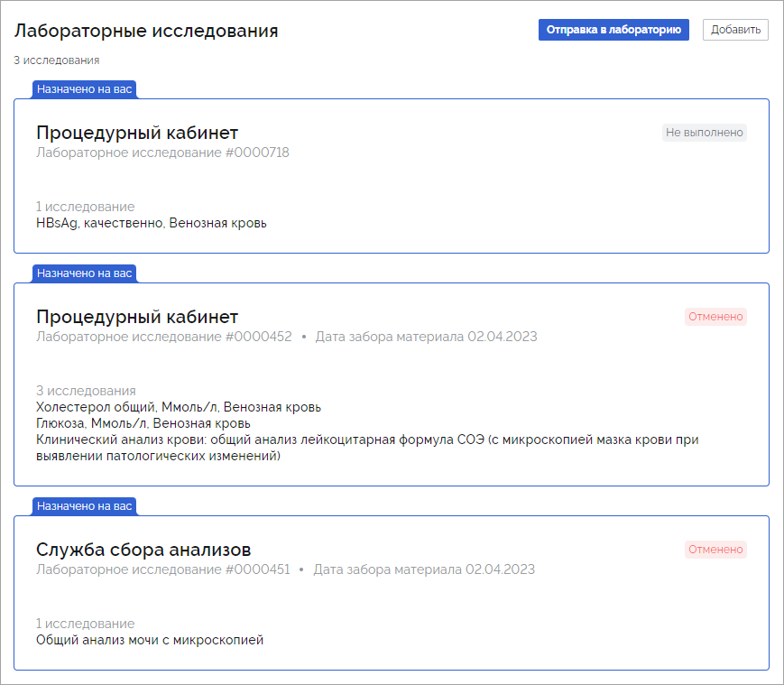
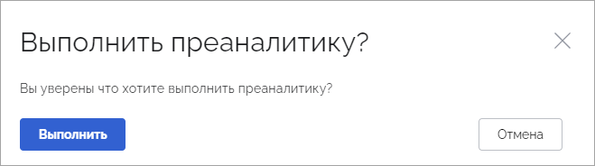
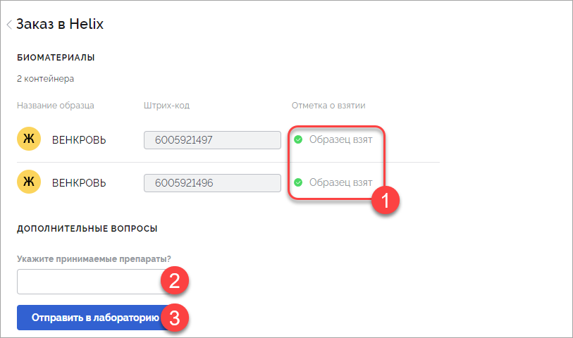
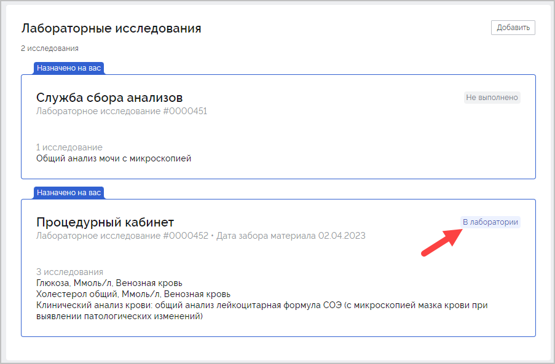
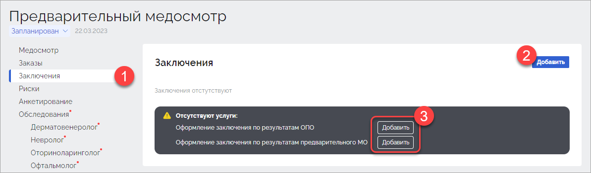

## Термины и определения

| Термин                    | Определение                                                  |
| ------------------------- | ------------------------------------------------------------ |
| Контрагент                | Юридическое лицо, которое заключает договор на проведение медицинских осмотров с организациями |
| Организация               | Юридическое лицо, которое направляет своих сотрудников на прохождение медицинских осмотров |
| Подразделение организации | Часть компании, осуществляющая свою деятельность в рамках деятельности всей компании. Как правило подразделение формируется для реализации конкретного направления хозяйственной деятельности компании. Например, отдел управления проектами, отдел разработки, административно-хозяйственный отдел. |
| Локация                   | Часть организации, осуществляющая свою деятельность за пределами местонахождения головного офиса. |
| Пациент                   | Сотрудник организации (работник), которому предстоит пройти медицинский осмотр. |

## 1. Общая информация

В системе существует несколько ролей пользователей. В зависимости от роли пользователю доступны определенные функциональные возможности системы. Роли пользователей системы:

1. Администратор: управляет работой клиники, работает с учетными записями сотрудников клиники, кабинетами.
1. Менеджер клиники: добавляет и группирует пациентов, формирует план медицинского осмотра, готовит отчеты перед работодателем.
2. Работник регистратуры: работает с расписанием, записывает пациентов на определенные даты и время, печатает обходной лист, добавляет документы пациента. 
3. Врач (сотрудник клиники): выполняет прием пациента, заполняет данные осмотра, ставит диагноз, подписывает протокол.
4. Профпатолог (может быть как отдельной ролью, так и совмещенной с врачом): знакомится с результатами обследования пациента, результатами лабораторных исследований, заполняет параметры для расчета рисков, формирует заключение.

Ниже представлен порядок действий каждого специалиста при работе с системой.

## 2. Авторизация

Для авторизации перейдите по адресу системы Интегра. В открывшемся окне нажмите кнопку **Войти**:

В открывшемся окне введите логин и пароль пользователя:

Отобразится интерфейс системы.

## 3. Настройка системы

Первичная настройка системы предполагает добавление контрагентов, организаций, договоров, счетов, контактной информации ответственных лиц.

### 3.1. Настройка контрагента

Настройка контрагента выполняется пользователем с ролью "Менеджер".

Для добавления контрагента перейдите в раздел **Контрагенты** (1) и нажмите кнопку **Создать** (2):

В окне **Новый контрагент** заполните требуемые поля и нажмите **Сохранить**:

Отобразится окно созданного контрагента, в котором станет доступна возможность добавления организации. Каждый контрагент может включать в себя множество организаций.

Для контрагента существует возможность добавления договоров с организациями (1), счетов (2) и контактных данных ответственных лиц (3):

В разделе **Договоры** содержатся договоры, заключенные между клиниками и  контрагентами. В разделе **Счета** содержатся документы, подтверждающие факт оплаты услуг контрагентом клинике. В раздел **Контакты** добавьте:

- контактную информацию менеджера контрагента (1);
- контактную информацию ответственного за работу с контрагентом сотрудников клиники (2):

Для изменения данных контрагента или его удаления нажмите на значок в виде карандаша:

В открывшемся окне внесите необходимые изменения и нажмите **Сохранить**:

#### 3.1.1. Добавление договора

Раздел в разработке

#### 3.1.2. Добавления счетов

Раздел в разработке

#### 3.1.3. Добавление контактных данных ответственных лиц контрагента

Раздел в разработке

### 3.2. Настройка организации

Настройка организации выполняется пользователем с ролью "Менеджер".

Для привязки новой организации к контрагенту перейдите в раздел **Контрагенты**, выберите требуемого контрагента и в блоке **Организации** нажмите кнопку **Создать**:

Откроется окно **Новая организация**. Заполните требуемые поля и нажмите кнопку **Создать**:

Созданная организация отобразится в блоке **Организации** ранее выбранного контрагента:

Для каждой организации существует возможность добавления подразделения (1), локации (2) и контактных данных ответственных лиц (3):

Для изменения данных организации или её удаления нажмите значок в виде карандаша:

В открывшемся окне внесите необходимые изменения и нажмите **Сохранить**:

#### 3.2.1. Добавление подразделения

Раздел в разработке

#### 3.2.2. Добавление локации

Раздел в разработке

#### 3.2.3. Добавление контактных данных ответственных лиц  организации

Раздел в разработке

### 3.3. Настройка медосмотров

Настройка медосмотров выполняется пользователем с ролью "Менеджер".

В системе доступны 3 вида медосмотров: предварительный, периодический и внеочередной. Настройка медосмотра представляет собой заполнение и передачу в медицинское учреждение файла с данными пациентов, которым требуется пройти медицинский осмотр. Данные пациентов формируются в файле формата [*.xlsx].

Настройка каждого вида медосмотров выполняется для конкретной организации из окна контрагента или из окна организации. Для настройки медосмотра:

Способ 1. В разделе **Контрагенты** кликните по записи требуемого контрагента. В открывшейся карточке контрагента в блоке **Организации** под записью каждой организации будут расположены строки с медосмотрами (1). Кликните по строке медосмотра (2) или по ссылке **Планирование** (3):

Способ 2. В разделе **Контрагенты** кликните по записи требуемого контрагента. В открывшемся окне в блоке **Организации** кликните по требуемой организации. В открывшейся карточке организации будет доступен блок **Медосмотры** (1). Кликните по строке медосмотра (2) или по ссылке **Планирование** (3):

Для загрузки файла со списком пациентов по конкретному медосмотру нажмите кнопку **Загрузить**:

Откроется окно **Загрузка медосмотров**. Кликните по ссылке **Выберите файлы…** или перетащите файл в строку (1). В случае отсутствия файла со списком пациентов кликните по ссылке **По шаблону** (2). Будет скачан шаблон файла, который требуется заполнить и загрузить в систему:

При наличии в загружаемом файле ошибок откроется окно с пояснениями. Исправьте ошибки в указанных ячейках и нажмите кнопку **Загрузить новый**:

При успешной загрузке файла будет выполнена проверка посещений пациента. Проверка выполняется на основе указанных в файле значений. В случае, если:

- В файле указаны данные, включая номер ЭМК и СНИЛС пациента. Будет осуществлен поиск медицинской карты пациента по номеру ЭМК. Если карта найдена, данные пациента в ЭМК будут обновлены. Если карта не будет найдена, отобразится ошибка. Выполните проверку номера ЭМК в файле.
- В файле указаны данные за исключением СНИЛС. Выполняется проверки, аналогичные предыдущему пункту. Проверьте корректность номера ЭМК пациента в файле.
- В файле указаны данные за исключением номера ЭМК. Будет осуществлён поиск медицинской карты пациента по СНИЛС. Если СНИЛС будет найден, выполнится проверка соответствия Ф.И.О. и даты рождения в ЭМК аналогичным данным из файла. Если найти СНИЛС не получится, проверка соответствия Ф.И.О. и даты рождения в ЭМК и файле будет пропущена.
- В файле указаны данные за исключением номера ЭМК и СНИЛС. Будет выполнена проверка соответствия Ф.И.О., даты рождения и номера телефона в базе аналогичным данным в файле. Если соответствие будет найдено, отобразится ошибка. Укажите номер ЭМК пациента в файле. 

Если данные пациента отсутствуют в системе, будет создана новая ЭМК.

Данные пациентов будут добавлены в ранее выбранный тип медосмотра:

#### 3.3.1. Планирование медосмотров

Раздел с планируемыми медосмотрами предназначен для формирования списка медосмотров с определенными периодами прохождения, из которых в дальнейшем пациент может выбрать удобные для себя даты записи на медицинский осмотр. Например, при отправке большого количества пациентов на медицинский осмотр в еще не определенную дату.

Для планирования медосмотра выделите записи требуемых пациентов и в отобразившейся вверху панели нажмите кнопку **Начало медосмотра**:

Откроется окно **Начало медосмотра**. Выберите пункт **Период начала** (1), укажите дату начала и дату завершения медосмотра (2), нажмите кнопку **Сохранить** (3) или установите значение **Без даты**. Тогда пациенту для выбора будет доступна совершенно любая дата, не ограниченная определенным периодом:

Статус медосмотров ранее выбранных пациентов изменится на "Запланирован":

Запланированный, но еще не начатый медосмотр не будет добавлен в расписание.

#### 3.3.2. Начало медосмотров

Если требуется начать медосмотр в данный момент, выделите записи требуемых пациентов и в отобразившейся панели нажмите кнопку **Начать**:

В открывшемся окне **Начать медосмотр** нажмите кнопку **Начать**:

На номер телефона и/или электронную почту ранее выбранных пациентов будет отправлена анкета. Записи пациентов будут перемещены в раздел **Активные**:

Для начала прохождения медосмотра пациент должен заполнить направленную ему анкету, выбрать время для записи и в выбранное им время явиться в клинику. В случае невозможности заполнения пациентом анкеты и/или выбора времени медосмотра можно будет записаться на медосмотр в регистратуре и заполнить анкету в поликлинике.

Для заполнения анкеты и выбора времени приема требуется перейти по ссылке, прикрепленной во входящем письме:

В открывшемся окне онлайн-анкеты требуется:

1. Пройти анкетирование (1).
2. Выбрать время для записи на прием (2).
3. Ознакомиться с перечнем документов, необходимых для прохождения медосмотра (3).
4. Ознакомиться с правилами подготовки к анализам (4):

После прохождения анкетирования и выбора времени для записи отобразится следующая информация:

На почту пациента поступит уведомление о записи на медицинский осмотр:

Далее пациенту требуется явиться в указанное время в поликлинику, имея с собой все требуемые документы.

#### 3.3.3. Формирование направлений

При направлении работодателем сотрудников на медицинский осмотр, каждому сотруднику формируется и выдается направление на медицинский осмотр. Направление формируется менеджером клиники после начала медосмотра. После получения от кадровой службы работодателя данных сотрудников в формате [*.xlsx], менеджер клиники загружает данные в систему и начинает медосмотр. После начала медосмотра становится доступной возможность формирования направления. 

Для формирования направления перейдите в раздел **Контрагенты**, выберите требуемую организацию и тип медосмотра. Перейдите на вкладку **Активные** (1) и выделите записи работников, для которых необходимо сформировать направление (2). Нажмите кнопку **Направления** (3):

Откроется файл направления, содержащий данные организации, наименование и адрес клиники, данные пациента и QR-код:

Скачайте файл направления и направьте сотруднику кадровой службы работодателя пациента. Сотрудник кадровой службы распечатает, подпишет и передаст пациенту данное направление. Пациент в назначенное время должен явиться в регистратуру клиники с данным направлением и паспортом. Сотрудник регистратуры выполнит сканирование QR-кода направления для нахождения медосмотра. После начала медосмотра QR-код из направления будет продублирован в обходном листе.

### 3.4. Настройка клиники

Настройка клиники выполняется пользователем с ролью "Администратор".

#### 3.4.1. Работа с учетными записями сотрудников клиники

Для создания новой учетной записи сотрудника клиники перейдите в раздел **Клиника** (1), откройте вкладку **Сотрудники** (2) и нажмите кнопку **Новый сотрудник** (3):

Откроется окно **Новый сотрудник**. Заполните данные нового сотрудника, придумайте пароль в соответствии с требованиями системы и нажмите кнопку **Создать**:

Будет сформирована карточка сотрудника клиники, содержащая личную информацию и роли сотрудника. После создания карточки укажите роль данного сотрудника в системе. Для этого в блоке **Роли** (1) нажмите кнопку **Задать роль** (2) либо нажмите на значок в виде карандаша (3):

Откроется окно **Редактирование ролей**. В соответствии в ролью сотрудника установите требуемый переключатель:

При выборе роли "Врач" отобразится поле **Специальность**. Воспользуйтесь поиском либо выберите необходимую специальность сотрудника из списка:

После выбора требуемых ролей сотрудника системы изменения будут сохранены автоматически. Передайте сотруднику клиники логин и пароль от учетной записи любым безопасным способом.

Для редактирования или удаления данных сотрудника клиники перейдите в раздел **Клиника **(1) - **Сотрудники** (2) и в строке поиска введите Ф.И.О. нужного сотрудника клиники:

Для изменения личных данных сотрудника клиники (фамилия, имя, отчество, номер телефона, электронная почта) а также удаления данных кликните по значку в виде карандаша (1).

Для изменения пароля сотрудника клиники или роли кликните по записи сотрудника (2):

#### 3.4.2. Работа со службами клиники

Раздел в разработке

## 4. Действия работника регистратуры перед началом медицинского осмотра

После получения и заполнения пациентом онлайн-анкеты ему требуется явиться в удобное время в клинику для прохождения медосмотра. В клинике пациенту необходимо обратиться к работнику регистратуры, который увидит профиль пациента в медосмотрах.

В случае, если пациент не заполнял анкету и не выбирал время медосмотра, перейдите в раздел **Пациенты** (1), в поле **Поиск** (2) введите Ф.И.О. пациента и откройте его электронную медицинскую карту (3):

В открывшейся электронной медицинской карте пациента кликните по названию запланированного медосмотра:

Откроется карточка медосмотра. Внизу карточки медосмотра в блоке **Документы** распечатайте все требуемые документы и передайте их на заполнение пациенту. Существует возможность печати как всех документов (кнопка **Все документы**), так и отдельных документов (значок в виде принтера справа от наименования документа):

В случае, если пациент ранее заполнял онлайн-анкету, она будет отсутствовать в списке документов и отобразится заполненной в разделе **Анкетирование**.

Пациент должен ознакомиться с переданными ему документами, подписать их и передать администратору.

Если пациент заполнял анкету непосредственно в клинике, зайдите в медосмотр пациента и загрузите туда запалённую анкету. Для этого перейдите в раздел **Анкетирование** (1) и в блоке **Результаты** нажмите **Загрузить** (2):

Откроется окно Результаты анкетирования. Укажите путь к файлу заполненной анкеты пациента или перетащите её в данное поле:

Нажмите кнопку **Сохранить**. Статус анкетирования изменится на "Выполнено". В блоке **Результаты** отобразится файл и дата загрузки анкеты:

После получения от пациента подписанных документов, измените статус медосмотра с "Запланирован" на "Обследование в процессе":

Пациент, руководствуясь данными из маршрутного листа, должен начать прохождение врачей в удобном для него порядке:

## 5. Действия врача

### 5.1. Обследование врачами

Каждый врач, к которому был направлен пациент, должен выполнить следующие действия:

1. Найти карточку пациента по Ф.И.О. или QR-коду из обходного листа пациента (в случае наличия у врача сканера).
2. Перейти в раздел медицинской карты пациента, который соответствует специализации врача.
3. Выполнить осмотр пациента, заполнить и подписать протокол осмотра.

Для открытия карты медицинского осмотра пациента перейдите в раздел **Медосмотры** (1), в строке поиска введите Ф.И.О. пациента (2) и кликните по записи с Ф.И.О. (3):

Откроется карточка медосмотра пациента. Выберите свою специализацию:

В открывшемся разделе карточки медосмотра пациента в строке **Протокол** нажмите ссылку **Заполнить**:

Будет открыт протокол приема:

Проведите осмотр пациента и заполните протокол. Некоторые поля обязательны к заполнению. В нижней части протокола осмотра доступна возможность постановки диагноза и указания противопоказаний. Для сохранения внесенных изменений нажмите кнопку **Сохранить**. Заполните все данные и нажмите кнопку **Подписать**:

Протокол осмотра конкретным врачом будет сохранен и доступен для ознакомления профпатологу. Статус осмотра будет изменен на "Завершен".

Пациенту необходимо завершить осмотры другими врачами, а также пройти определенный объем лабораторных исследований.

### 5.2. Лабораторные исследования

Для лабораторных исследований пациенту требуется предоставить определенный объем биоматериалов. Информация о том, какие исследования требуется выполнить для пациента, доступна процедурным медсестрам.

Для открытия медицинской карты пациента перейдите в раздел **Медосмотры** (1), в строке поиска введите Ф.И.О. пациента (2) либо используйте QR-код, указанный в направлении или маршрутном листе. Кликните по записи с Ф.И.О. (3):

В открывшейся карточке медосмотра перейдите в раздел **Лабораторные исследования**:

В зависимости от пола и возраста пациента, факторов и видов его деятельности отобразится определенное количество типов исследований. Также существует возможность ручного добавления исследований врачом.

Кликните по исследованию, ознакомьтесь с видами исследований и нажмите **Начать сбор биоматериалов**:

Для подтверждения начала сбора биоматериалов в всплывающем окне нажмите кнопку **Начать**:

Будет выполнена преаналитика и отобразится список необходимых лабораторных исследований. Выполните подготовку контейнеров. Существует 2 варианта подготовки контейнеров со штрихкодами:

Вариант 1. Реализована интеграция между Интегрой и лабораторией. Возьмите рулон со штрихкодами, отклейте от штрихкод и нанесите его на контейнер. Аналогичным способом промаркируйте необходимой количество контейнеров. Возьмите у пациента требуемые образцы биоматериалов, поместите их в контейнеры с соответствующими штрихкодами. Установите курсор мыши в поле **Штрих-код** и считайте сканером штрих-код с контейнера. Установите контейнер с биоматериалом в паллет и установите отметку о взятии. Отметка о взятии носит информационный характер.  Повторите действия по считыванию штрих-кода для оставшихся контейнеров.

Вариант 2. Использование принтера штрихкодов (лейблера). В данном случае штрих-код генерируется Интегрой автоматически. Справа от поля **Штрих-код** нажмите кнопку **Печать**. Лейблер выполнит печать ранее сгенерированного кода на контейнере, возьмите данный контейнер и поместите туда образец биоматериала пациента. Установите отметку о взятии и повторите действие для остальных контейнеров. Отметка о взятии носит информационный характер. 

Убедитесь, что собраны все необходимые образцы биоматериалов (1), в случае необходимости укажите ответы на дополнительные вопросы (2) и нажмите кнопку **Отправить в лабораторию** (3):

Заказ будет сформирован и отправлен в лабораторию:

В карточке медицинского осмотра статус лабораторного исследования изменится на "В лаборатории":

После выполнения лабораторных исследований биоматериалов пациента, результаты будут автоматически добавлены в систему и станут доступны врачам для ознакомления.

### 5.3. Мероприятия вне клиники

Работнику регистратуры доступна возможность добавления в карточку медосмотра результатов исследований или заключений врачей, которые уже имеются у пациента (например, результаты прохождения рентгенологического исследования), или направления пациента на дополнительное обследование в другую клинику. Для этого перейдите в раздел **Мероприятия вне клиники** (1) и нажмите кнопку **Добавить** (2):

В открывшемся окне **Новое мероприятие** выберите тип услуги (1), укажите или измените название (2) и нажмите кнопку Создать (3) или сразу нажмите кнопку **Запланировать** (4) для формирования приема. В данном случае мероприятие будет создано и сохранено.

Отобразится запланированное и/или сформированное мероприятие:

Перейдите в запланированное мероприятие и сформируйте направление. Для этого кликните по записи с требуемым мероприятием:

В открывшемся окне запланированного мероприятия кликните по записи с направлением, или нажмите ссылку **Заполнить** справа от него:

Заполните направление и нажмите кнопку **Сохранить**:

Направление будет сформировано и отобразится в разделе мероприятий. Распечатайте направление и передайте пациенту:

После прохождения пациентом запланированных мероприятий и предоставления результатов загрузите их в карточку мероприятия. Для этого кликните по строке **Результаты** или по ссылке **Загрузить**:

В открывшемся окне укажите путь к файлу с результатами выполненного мероприятия или перетащите его в данное поле (1), укажите дату прохождения мероприятия пациентом (2) и нажмите кнопку **Сохранить** (3):

Карточка ранее назначенного мероприятия вне клиники примет соответствующий вид:

## 6. Действия работника регистратуры при завершении медицинского осмотра

После прохождения пациентом осмотров врачей в соответствии с маршрутным листом, завершения функциональных и лабораторных исследований требуется изменить статус карточки медицинского осмотра на "Обследование завершено". Для этого перейдите в раздел **Медосмотры** (1), в строке поиска введите Ф.И.О. пациента (2) либо воспользуйтесь QR-кодом с направления или маршрутного листа. Кликните по записи с Ф.И.О. (3):

Откроется карточка медосмотра пациента. В левой верхней части карточки медицинского осмотра измените статус с "Обследование в процессе" на "Обследование завершено":

В случае, если пациент не успел пройти все обследования врачами или сдать биоматериал для выполнения требуемых лабораторных исследований, установите статус "Обследование не завершено". Медицинский осмотр можно будет возобновить в дальнейшем, изменив статус медицинского осмотра с "Обследование не завершено" на "Обследование в процессе".

В конце рабочего дня работнику регистратуры рекомендуется проверять все статусы медицинских осмотров для ручного завершения открытых медицинских осмотров или связи с работодателем пациента. Например, в случае завершения пациентом всех врачебных осмотров, лабораторных и инструментальных исследований без обращения в регистратуру по прохождении медосмотра.

## 7. Действия профпатолога

После завершения медицинского осмотра пациентом профпатологу необходимо ознакомиться с его карточкой медицинского осмотра. Задача профпатолога изучить результаты обследования пациента врачами и лабораторных исследований, заполнить параметры для расчета рисков, учесть данные анкетирования и сформировать заключение.

### 7.1. Расчет рисков

Для расчета рисков перейдите в раздел **Медосмотры**.  В списке медосмотров найдите  медосмотр пациента со статусом "Обследование завершено". Для удобства поиска в строке фильтров для фильтра **Статус** установите значение "Обследование завершено":

Кликните по записи с требуемым медосмотром. Откроется карточка медосмотра. Перейдите на вкладку **Риски**:

Кликните по ссылке **Заполнить** для указания параметров расчета рисков:

Откроется окно **Параметры для расчета**. Часть данных полей могут быть автоматически заполнены данными из осмотров врачами. Заполните все оставшиеся поля, отмеченные красной звездочкой, предварительно изучив анкету пациента. Нажмите кнопку **Рассчитать риски**:

Будут рассчитаны риски и сформированы результаты:

### 7.2. Формирование заключения

Для формирования заключения по медицинскому осмотру пациента перейдите в на вкладку  **Заключение профпатолога** и нажмите кнопку **Создать**:

В окне **Заключение профпатолога** выполните следующие действия:

1. В случае наличия у пациента противопоказаний к работе укажите их в строке **Противопоказания** (1). В случае наличия у пациента противопоказаний измените вариант "Нет противопоказаний" на "Есть противопоказания". Укажите факторы риска, к которым относятся данные противопоказания, а также укажите группу здоровья:

2. Укажите комментарии в поле **Примечание** (2).

3. Укажите дату формирования заключения (3).

4. При наличии поставленных диагнозов кликните по ссылке **Добавить..** и выберите необходимые диагнозы (4).

5. Заполните статистическую информацию: нуждается ли пациент в амбулаторном, стационарном, санаторно-курортном обследовании и лечении или в диспансерном наблюдении:

После заполнения всех необходимых полей нажмите кнопку **Сохранить**. Будет сформирован и сохранен черновик заключения профпатолога:

Если нужно внести изменения в заключение профпатолога, в правом верхнем углу нажмите на значок в виде трех точек и выберите вариант **Редактировать** (1). Для удаления текущего варианта заключения нажмите **Удалить** (2):

Подпишите заключение.  Для этого нажмите кнопку **Подписать**:

Подтвердите подписание:

И измените статус медосмотра на "Заключение сформировано":

## 8. Действия работника регистратуры после формирования заключения профпатологом

После формирования профпатологом заключения по медицинскому осмотру пациента, подготовьте и передайте пациенту пакет документов. Для этого перейдите в раздел **Медосмотры** (1), в строке поиска введите Ф.И.О. пациента (2). Кликните по записи с Ф.И.О. (3):

Откроется карточка медосмотра пациента. Перейдите в раздел **Исходящие документы** (1) и распечатайте все доступные документы (2):

В случае, если в вашем медицинском учреждении есть договоренность с работодателем пациента о передачи всех документов непосредственно пациенту, передайте их пациенту и измените статус медицинского осмотра на "Пакет документов выдан":

В случае отсутствия такой договоренности весь пакет документов доставляется работодателю силами медицинского учреждения. В данном случае работники медицинского учреждения  выполняют поиск медосмотров пациентов с готовыми заключениями, печатают данные заключения, подписывают, ставят печати, собирают пакет и передают работодателю пациентов.

На данном этапе работа с пациентом закончена. В зависимости от требований медицинского учреждения после медосмотра или в конце календарного года требуется сформировать заключительные акты по организациям.

## 9. Формирование заключительных актов

В задачи профпатолога входит формирование заключительных актов по завершенным периодическим медосмотрам.

Для формирования заключительных актов перейдите в раздел **Контрагенты** (1) и кликните по записи требуемого контрагента (2):

В открывшемся окне откройте под нужной организацией кликните по записи с периодическим медосмотром:

В открывшемся окне выберите пациентов, завершивших медосмотр, и сформируйте заключительный акт.
