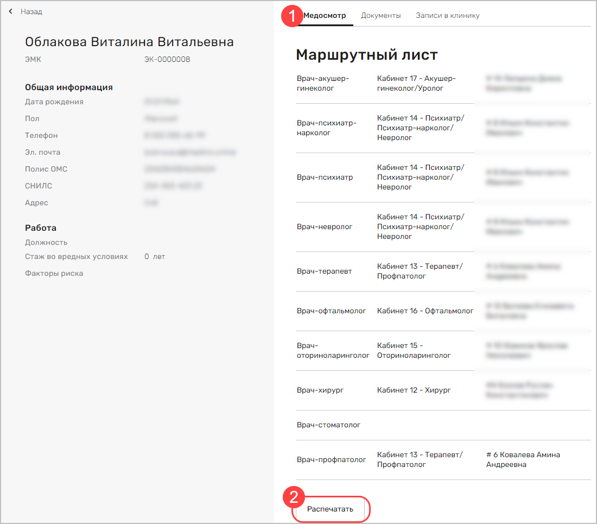

# Профмед Интегра. Руководство пользователя

## Авторизация

В системе существует несколько ролей пользователей. В зависимости от роли, пользователю доступны различные функции системы. Роли пользователей системы:

1. Менеджер клиники. Добавляет и группирует сотрудников. Формирует план медицинского осмотра.
2. Регистратор (Администратор клиники). Работает с расписанием. Записывает пациентов на определенные даты и время. Печатает обходной лист. Добавляет документы пациента.
3. Врач. Выполняет прием пациента. Заполняет данные осмотра, ставит диагноз, подписывает протокол.
4. Профпатолог (Может быть как отдельной ролью, так и совмещен с врачом). Выдает заключение и печатает документы.

Ниже представлен порядок работы с системой от лица каждого из специалистов.

Для авторизации перейдите по адресу системы Профмед. В открывшемся окне нажмите кнопку **Войти**:

В открывшемся окне введите логин и пароль пользователя:

## Запуск анкетирования

Для запуска анкетирования пациента авторизуйтесь, используя учетную запись менеджера. После авторизации откроется окно **Пациенты**:

Нажмите за запись с требуемым пациентов. Откроется карточка пациента. Для редактирования информации пациента нажмите кнопку **Редактировать** (1). Для отправки пациента на медосмотр нажмите **Отправить** (2):

В окне редактирования пациента доступна возможность изменения личной информации (1), контактных данных (2), СНИЛС и полиса ОМС (3):

Для формирования и отправки пациенту ссылки на онлайн-анкету, нажмите кнопку **Отправить**:

Ссылка на анкету будет направлена пациенту на электронную почту и в виде смс на номер мобильного телефона. 

Пациент должен пройти анкетирование и выбрать удобную дату и время для прохождения медицинского осмотра. Также пациенту будет доступна информации о необходимости сдачи конкретных анализов и проведения инструментальных исследований. Данные действия требуется выполнить до даты начала прохождения медосмотра. Если пациент не завершит все требуемые инструментальные исследования или не сдаст все анализы, завершить медицинский осмотр будет невозможно.

В выбранную дату и время  пациент должен явиться в клинику для прохождения медицинского осмотра.

## Печать обходного листа

После того, как пациент явился на прохождение медицинского осмотра необходимо распечатать и передать пациенту обходной лист либо перенести запись пациента на другое время (например, пациент не успел завершить все инструментальные исследования или сдать нужные анализы).

Авторизуйтесь под учетной записью регистратора (администратора клиники). Откроется окно **Расписание**:

Данный раздел позволяет записать нового пациента либо перенести запись текущих. Пациент, которому требуется распечатать обходной лист и начать прохождение медицинского осмотра имеет статус "В процессе". Пациент, который находится в процессе прохождения медицинского осмотра имеет статус "Запланирован".

Для печать обходного листа пациента нажмите на запись требуемого пациента со статусом "В процессе". Откроется электронная медицинская карта пациента. По умолчанию будет открыт раздел **Документы** (1):

Добавьте скан паспорта пациента, результаты инструментальных исследований и результаты анализов (2).

После проверки (загрузить документы в ЭМК карту пациента можно после передачи ему обходного листа) всех требуемых документов перейдите на вкладку **Медосмотр**. В блоке Маршрутный лист будут указаны все врачи, которых необходимо посетить пациенту. Распечатайте этот список нажав кнопку **Печать** (2) и передайте лист пациенту.  

Все загруженные документы становятся доступны для просмотра медицинскими работниками, к которым был направлен пациент.

## Прием пациента

Для приема пациента авторизуйтесь под учетной записью врача (медицинского работника). Откроется окно **Расписание**:

Нажмите на запись требуемого пациента. Откроется его электронная медицинская карта. Ознакомьтесь с доступной информацией и приступите к заполнению протокола приема. Для этого нажмите кнопку **Начать прием**:

Откроется протокол приема пациента. Укажите давление пациента (используется для расчета рисков сердечно-сосудистых заболеваний), уровень холестерина а также заполните остальные данные осмотра:

Заполните диагноз пациента и нажмите кнопку **Подписать**:

Данные будут направлены на обработку системой поддержки принятия решений. Из протокола уберутся оказанные услуги, рядом с Ф.И.О. врача будет установлена отметка о прохождении (зеленая галочка). Распечатайте протокол (1) и завершите прием (2):

Подтвердите завершение приема:

Далее, пациент направляется к остальным специалистам из обходного листа.

## Подготовка заключения и документов

После прохождения пациентов всех врачей и добавления всех документов (результаты медицинских исследований и анализы) статус пациента изменится на "Медосмотр пройден". 

Авторизуйтесь под учетной записью профпатолога, сформируйте заключение и сопутствующие документы. Передайте пакет документов в отдел контроля качества. После проверки клиника направит проверенный и подписанный пакет документов работодателю или самому пациенту.
