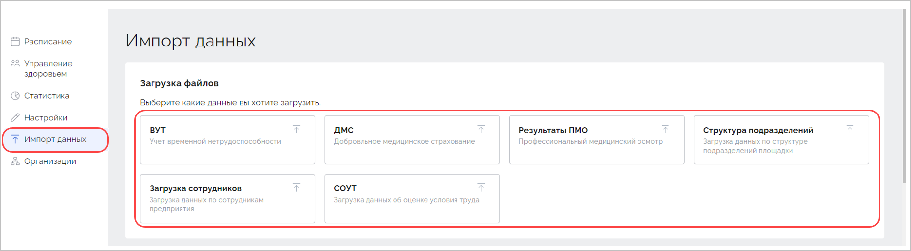
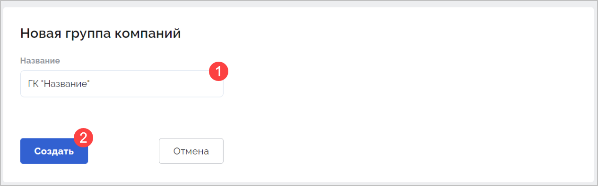
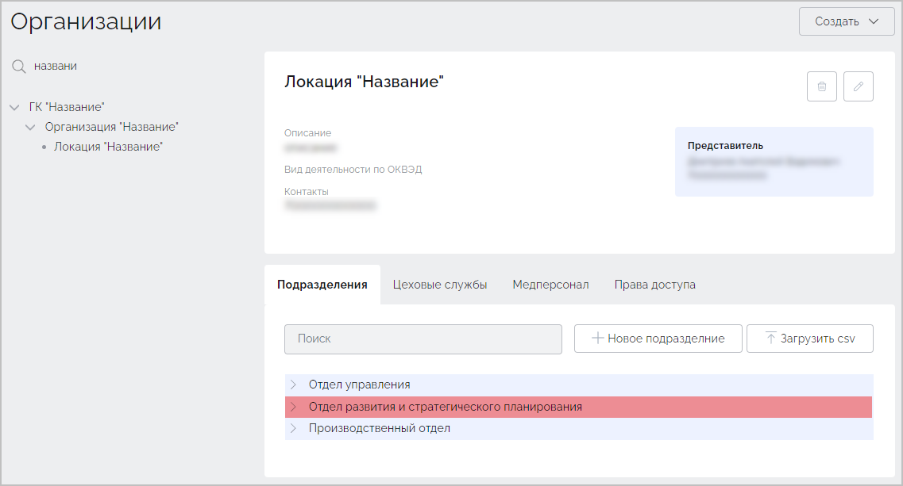
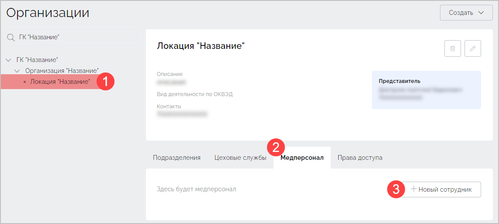
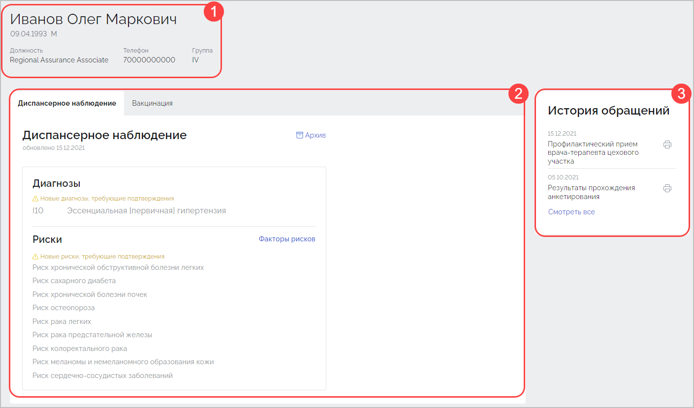
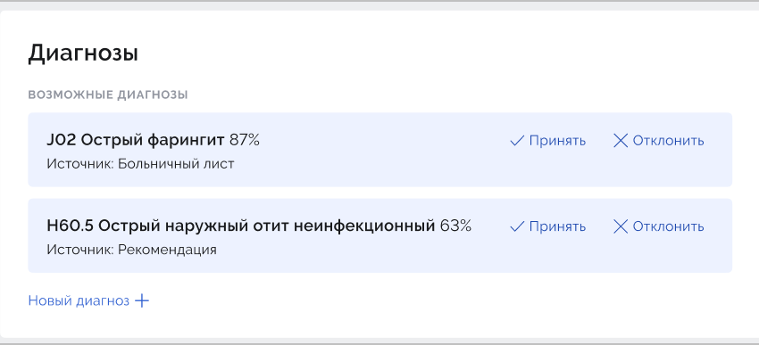
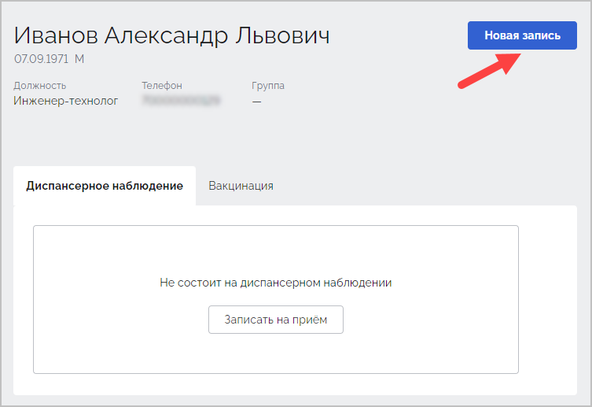

# Руководство пользователя Профмед

## Общая информация

Программное обеспечение Профмед предназначено для автоматизации процессов работы цеховой врачебной службы на предприятиях.

Основная функциональная возможность Профмед — выполнение расчетов диагнозов, рисков и формирование плана наблюдения на основе деперсонализированных медицинских данных сотрудников.

Профмед взаимодействует со специализированным программным обеспечением для выполнения расчетов диагнозов, рисков и плана наблюдения на основании медицинских данных сотрудников.

Основные функциональные характеристики Профмед:

- Авторизация и идентификация пользователей с использованием OAuth 2.0.
- Расписание цехового врача для планирования работы и проведения приемов.
- Проведение удаленного анкетирования сотрудников предприятия для предварительного сбора важнейшей анамнестической информации и оценки общего состояния здоровья.
- Расчет предварительных рисков возможных хронических неинфекционных заболеваний по результатам анкетирования.
- Просмотр результатов анкетирования с ранжированием сотрудников по приоритетности проведения очного приема сотрудников.
- Проведение очного приема с заполнением электронной формы протокола осмотра.
- Расчет возможных диагнозов на основании заполненного протокола и результатов анкетирования.
- Расчет возможных рисков возникновения заболевания на основании заполненного протокола осмотра.
- Генерация плана наблюдения за сотрудником и его редактирование на основании установленных диагнозов и рисков у сотрудника.
- Просмотр карточки пациента, которая содержит данные по диспансерному наблюдению, а также данные истории осмотров пациента.

В случае, если при работе с системой возникнет окно с предупреждением о необходимости обновления страницы, для продолжения дальнейшей работы с системой нажмите кнопку **Обновить**:

Данная функция обеспечивает обновление системы без приостановки ее работы.

## Авторизация

Перейдите по адресу системы Профмед. В открывшемся окне нажмите кнопку **Войти**:

Для входа в систему используйте логин и пароль. Нажмите кнопку **Войти**:

В случае успешной авторизации откроется окно **Расписание**:

## Начало работы

Раздел "Начало работы" предназначен для администраторов системы, которые обеспечивают её настройку и поддерживают функционирование. Если вы являетесь сотрудником предприятия, в задачи которого входит только работа с пациентами, начните знакомство с системой с раздела "Работа с пациентом". 

Для начала работы с системой администратору необходимо выполнить определенные действия, которые включают добавление всех необходимых для функционирования системы данных и её настройку. К таким действиям относятся:

1. Импорт данных.  Добавление информации по подразделениям, сотрудникам, ВУТ, ПМО, ДМС и СОУТ.
2. Настройку организаций. Формирование группы компаний, добавление организаций, локаций, подразделений, цеховой медицинской службы, данных медицинских работников.
3. Настройку учетных записей сотрудников цеховой медицинской службы.

Пошаговое описание каждого действия представлено в следующих подразделах.

### Импорт данных

Функция импорта данных доступна только пользователям с определенными правами. Раздел **Импорт данных** позволяет добавить следующие данные:

1. Данные по структуре подразделений. Необходимо загрузить до начала загрузки данных по сотрудникам предприятия.
2. Данные по сотрудникам предприятия. Необходимы для работы системы.
3. Данные по временной нетрудоспособности. Используются для построения отчетов по временной утрате нетрудоспособности сотрудников предприятия.
4. Результаты ПМО. Необходимо загружать после прохождения сотрудниками предприятия предварительного медицинского осмотра во внешней клинике.
5. ДМС. Необходимо загружать после обращений сотрудников предприятия за медицинской помощью в рамках программы добровольного медицинского страхования. Данные используются для расчетов по пациентам и отчетности.
6. СОУТ. Данные по условиям труда.

Содержимое каждого загружаемого файла должно содержать значения, расположенные в строго определенном порядке, без запятых и пустых полей, в соответствии со схемой, представленной в Приложении 1.

Для загрузки данных перейдите в раздел **Импорт данных** и выберите доступный для загрузки тип данных:

После выбора любого из типа данных, откроется окно загрузки файла. Нажмите кнопку **Выберите файлы…** и укажите путь к файлу в формате `.csv`.

В блоке Файл отобразится информация об успешной или неуспешной загрузке. В случае необходимости добавьте комментарий (1) и нажмите кнопку **Загрузить** (2). Для возврата в раздел **Импорт данных** без сохранения изменений нажмите кнопку **Отмена** (3):

Запись с информаций о добавленном файле будет добавлена в блок **История загрузок**. Для поиска ранее загруженных файлов воспользуйтесь фильтрами по периоду загрузки (1) и типам загружаемых данных:

Для контроля количества загруженных файлов при их одновременной загрузке, воспользуйтесь счетчиком данных, который отображает количество обработанных и добавляемых файлов:

В случае загрузки одного файла, индикатором успешного добавления данных в систему служит статус "Успешно" (1). При одновременной загрузке нескольких файлов, индикатором успешного добавления  данных в систему служит равное количество обработанных и добавляемых файлов (2):

### Работа с организациями

Для начала работы с системой необходимо добавить информацию по группам компаний, организациям,  локациям, медицинским службам, должностям и сотрудникам цеховой медицинской службы. Добавление требуемых данных осуществляется через раздел **Организации**.

> Раздел **Организации** доступен только пользователям с определенными правами.

В случае, если в систему требуется добавить несколько организаций, начните с добавления группы компаний. Если в системе предполагается работа только с одной компанией, начните сразу с добавления организации.

#### Добавление группы компаний

Группа компаний — объединение нескольких организаций в одну сущность. Для создания новой группы компаний перейдите в раздел **Организации** и в правом верхнем углу нажмите кнопку **Создать**:

В выпадающем списке выберите вариант **Группа компаний**:

В открывшемся окне **Новая группа компаний** введите название группы (1) и нажмите кнопку **Создать** (2):

> Название группы компаний не должно превышать 64 символа с пробелами.

Отобразится добавленная группа компаний. Для удаления группы компаний нажмите значок в виде корзины (1). Для изменения названия группы компаний нажмите значок в виде карандаша (2):

#### Добавление организации

Для создания новой организации перейдите в раздел **Организации** и в правом верхнем углу нажмите кнопку **Создать**:

В выпадающем списке выберите вариант **Организацию**:

Откроется окно **Новая организация**:

В поле **Группа компаний** (1) укажите группу компаний, в которую будет добавлена создаваемая организация. Если не планируется объединять организации в группу компаний, оставьте данное поле пустым.

В поле **Название** (2) введите наименование организации. Данное поле является обязательным для заполнения.

В поле **Описание** (3) добавьте дополнительную информацию об организации, которая может упростить ее идентификацию.

В выпадающем списке **Вид деятельность по ОКВЭД** (4) выберите подходящие варианты видов экономической деятельности либо начните вводить название или код деятельности:

В блоке **Контакты** (5) укажите юридический и фактический адрес, адрес электронной почты и телефон организации.

В блоке **Представитель** (6) укажите Ф.И.О. сотрудника организации и его телефон.

В блоке **Ответственный менеджер СОГАЗ** (7) укажите Ф.И.О. менеджера.

 Проверьте указанные данные и нажмите кнопку **Создать** (8).

Созданная организация отобразится в соответствующем разделе. Для удаления созданной организации нажмите значок в виде корзины (1). Для внесения изменений в карточку созданной организации нажмите значок в виде карандаша (2):

#### Добавление локации

Локация (площадка) — объединение нескольких цеховых служб в рамках одной организации.

> Перед созданием локации убедитесь, что добавлена хотя бы одна организация.

Для добавления локации откройте необходимую организацию и нажмите кнопку **Создать локацию**:

Откроется окно **Новая локация**. Заполнителя требуемые поля и нажмите кнопку **Создать**:

Информация о локации будет добавлена к организации:

В случае необходимости создания нескольких локаций для требуемой организации, в левом меню выделите организацию и нажмите кнопку **Новая локация**.

#### Добавление подразделения

Подразделение — часть организации вместе с относящимися к ней работниками, выполняющими установленный круг обязанностей. Подразделения выделяются по признаку общности выполняемых работ.

> Перед добавлением подразделения убедитесь, что добавлена организация и локация.

Для создания нового подразделения перейдите в любую из локаций требуемой организации (1) и на вкладке **Подразделения** (2) нажмите кнопку **Новое подразделение** (3):

При отсутствии в системе ранее добавленных подразделений откроется окно вида:

В случае, если ранее было добавлено хотя бы одно подразделение, а также добавлены цеховые службы, откроется окно следующего вида:

Укажите название и код подразделения. В зависимости от ранее добавленных подразделений или цеховых служб, укажите родительское подразделение и выберите цеховую службу. Если добавлена только одна цеховая служба, она будет выбрана автоматически. Нажмите кнопку **Создать**. На вкладке **Подразделения** будет добавлено новое подразделение:

Для привязки к подразделению цеховой службы …

#### Добавление цеховой службы

> Перед добавлением цеховой медицинской службы, убедитесь что добавлена организация и локация.

Для добавления цеховой службы перейдите в любую из локаций требуемой организации (1) и на вкладке **Цеховые службы** (2) нажмите кнопку **Новая цеховая служба** (3):

Откроется окно **Новая цеховая служба**. Введите название цеховой службы и нажмите кнопку **Создать**:

Созданная цеховая служба будет добавлена в соответствующей вкладке локации:

Для изменения цеховой службы нажмите значок в виде карандаша. В открывшемся окне **Изменение цеховой службы** внесите необходимые изменения и нажмите кнопку **Сохранить**:

Для удаления цеховой службы нажмите значок в виде корзины. В открывшемся окне подтвердите удаление нажатием кнопки **Удалить**:

Цеховая служба будет удалена из системы.

#### Добавление сотрудника медицинской службы

> Перед добавлением сотрудника убедитесь что добавлена организация и локация.

Для добавления сотрудника цеховой медицинской службы перейдите в любую из локаций требуемой организации (1) и на вкладке **Медперсонал** (2) нажмите кнопку **Новый сотрудник** (3):

Откроется окно **Новый сотрудник**:

Заполните поле ФИО, выберите должность и специализацию. Если ранее уже были созданы цеховые службы, укажите цеховую службу, к которой будет относиться данный сотрудник. Если добавлена только одна цеховая служба, она будет выбрана автоматически. Нажмите кнопку **Создать**. Созданный сотрудник цеховой медицинской службы будет добавлен в соответствующую вкладку локации:

Для изменения информации о сотруднике нажмите значок в виде карандаша. В открывшемся окне **Изменение сотрудника** внесите необходимые изменения и нажмите кнопку **Сохранить**:

Для удаления сотрудника нажмите значок в виде корзины. В открывшемся окне подтвердите удаление нажатием кнопки **Удалить**:

Данные сотрудника будут удалены из системы.

### Настройки

Раздел **Настройки** обеспечивает возможность работы с данными пользователей системы, а именно: 

- настройку стартовой анкеты для новых сотрудников;
- настройку расписания конкретного медицинского  работника;
- выбор доступных шаблонов протоколов;
- изменение данных для входа;
- изменение прав доступа.

Настройки определяются для каждой конкретной площадки. Доступ к настройкам имеют только сотрудники с определенной ролью.

Для перехода в раздел **Настройки** нажмите соответствующую кнопку в левом меню. Откроется раздел, содержащий вкладки **Стартовая анкета** и **Медперсонал**:

#### Стартовая анкета

После добавления нового сотрудника предприятия для него формируется ссылка на прохождение первого анкетирования.

Каждый пользователь системы имеет возможность настройки анкетирования, а именно указание способа получения ссылки на прохождение анкетирования сотрудниками предприятия и ограничение количества дней на заполнение анкеты:

Укажите способ получения ссылки на анкету, установив переключатель в положение **По смс** или **На эл. почту**. Также задайте максимально возможный срок прохождения анкеты. Нажмите кнопку **Сохранить**.

#### Настройка расписания сотрудника

Для каждого медицинского работника необходимо настроить расписание его рабочего дня. Расписание разбито на определенные периоды, каждый из которых может собственный уникальный график работы.

Для создания нового расписания, на вкладке **Медперсонал** кликните по записи с данными медицинского работника:

Откроется карточка медицинского работка. По умолчанию будет выбран раздел **Расписание**.

Укажите длительность приема медицинским работником (1). В зависимости от указанного значения будет рассчитано количество пациентов, возможных для записи на рабочий день медицинского сотрудника. В блоке, содержащим информацию по графику работы, задайте временной период, в течение которого будет актуален данный график работы медицинского работника (2):

Укажите дни недели которые будут являться рабочими для данного сотрудника, путем установки соответствующих чекбоксов: 

Если чекбокс не установлен — день недели будет считаться выходным и запись пациентов на него будет невозможна. 

Если в указанный временной период у медицинского работника планируется отсутствие на рабочем месте, в блоке **Нерабочие дни** нажмите кнопку **Добавить** и укажите периоды отсутствия медицинского работника:

Выберите время начала и окончания рабочего дня (1), в случае необходимости укажите время на перерыв (2).  

Для добавления нового периода отсутствия нажмите кнопку **Добавить** (1). Для добавления нового периода и связанного с ним графика работы нажмите кнопку **Добавить период** (2):

Автоматически, будет сформирован календарь медицинского работника, отображающий рабочие и выходные дни. После заполнения всей необходимой информации нажмите кнопку **Сохранить**. 

Для удаления расписания нажмите кнопку **Удалить**:

В окне подтверждения также нажмите кнопку **Удалить**:

Расписание будет удалено.

#### Выбор доступных шаблонов протоколов

Для каждого медицинского работника в зависимости от его роли можно установить типы протоколов, которые будут доступны для дальнейшего выбора медицинским работником в процессе проведения приема сотрудника предприятия. 

Перейдите в карточку медицинского работника и нажмите кнопку **Доступные шаблоны протоколов**. Откроется соответствующий раздел:

Для добавления нового протокола приема установите курсор в строку поиска и начните вводить название протокола. В окне с предложенными результатами выберите необходимый протокол:

 Добавленные шаблоны протоколов отобразятся под стройкой поиска:

Для удаления протокола приема нажмите значок в виде крестика справа от наименования протокола. 

Для сохранения изменений нажмите кнопку **Сохранить**.

#### Изменение данных для входа

Для авторизации в системе каждый пользователь системы использует логин и пароль. Соответственно, после добавления данных нового пользователя для него необходимо сформировать учетные данные в виде логина и пароля. В качестве логина обычно указывается адрес электронной почты. Пароль формируется в соответствии с требованиями информационной безопасности предприятия.

Для создания новой учетной записи пользователя системы или её изменения, в карточке медицинского работника перейдите в раздел **Данные для входа**. В открывшемся окне введите новый логин и/или пароль и нажмите кнопку **Сохранить**:

#### Изменение прав доступа

Для каждого пользователя системы необходимо установить определенные права доступа к функциональным возможностям системы. По умолчанию все права пользователя системы отключены.

Для настройки прав доступа конкретного пользователя системы в его карточке перейдите в раздел **Права доступа**. Отобразится блок с перечнем доступных возможностей. Укажите роль специалиста (1) в зависимости от выбора которой будут установлены определенные права пользователя (2):

Для добавления нужного права вручную, установите переключатель в положение "Включено" (будет подсвечен синим), справа от соответствующего названия:

В данном разделе все внесенные изменения сохраняются автоматически.

## Работа с пациентом

### Поиск сотрудника

Для поиска сотрудника, в строке поиска, расположенной в верхнем левом углу, введите полное или частичное Ф.И.О. сотрудника. Нажмите клавишу `Enter`. Строка поиска доступна на любой из страниц системы.

После выполнения  поиска будет выполнен переход на страницу с результатами:

Для перехода в карточку пациента, кликните по строке с Ф.И.О. Откроется карточка пациента.

### Карточка пациента

Для каждого пациента в системе, на основе ранее загруженных данных, автоматически создается карточка пациента.  Если пациент не состоит на диспансерном наблюдении, его карточка будет иметь следующий вид:

Если пациент уже состоит на диспансерном наблюдении, его карточка будет иметь следующий вид:

Карточка пациента в себя следующие блоки:

- информацию о сотруднике (1);
- диспансерное наблюдение (2);
- историю обращений (3).

#### Информация о сотруднике

Блок информации о сотруднике содержит:

- фамилию, имя и отчество пациента;
- дату рождения, пол (М/Ж);
- данные места работы — должность, номер телефона, группу.

#### Диспансерное наблюдение

Данный блок отображается только для сотрудников, состоящих на диспансерном наблюдении.

Блок **Диспансерное наблюдение** включает:

- архив (1);
- диагнозы, риски (2);
- целевые показатели (3);
- план мероприятий (4).

##### Блок "Диагнозы, риски"

Блок **Диагнозы, риски** включает предварительные и подтвержденные диагнозы, которые были добавлены медицинским работником во время приема или автоматически предложены системой а также риски, принятые медицинским работником во время приема либо рассчитанные системой автоматически.

Для просмотра ответов сотрудника, по которым были рассчитаны риски, нажмите на ссылку **Факторы рисков**. Откроется окно с результатами:

Для просмотра диагнозов и рисков, которые были сняты с наблюдения во время приема, нажмите на ссылку **Архив**. Откроется окно с перечнем диагнозов и/или рисков:

##### Блок "Целевые показатели"

Блок **Целевые показатели** содержит информацию по качественным и количественным измерениям и их целевым показателям, которые могут быть получены в результате анкетирования либо на основе проведенных исследований. Блок содержит следующие элементы:

- динамика измерений (1);
- наименование измерения (2);
- дата последнего измерения (3);
- данные последнего измерения (4);
- целевые показатели (5).

Для просмотра динамики качественных измерений, нажмите на значок **Просмотр динамики измерений на графике**:

Откроется окно с десятью последними измерениями в виде графика:

##### Блок "План мероприятий"

Блок **План мероприятий** содержит план исследований и и консультаций по диагнозам.

Для фильтрации мероприятий по конкретному диагнозу а также по необходимым исследованиям или консультациям, воспользуйтесь фильтром:

Для загрузки документа по исследованию или консультации, напротив необходимого мероприятия нажмите на ссылку **Загрузить**:

#### История обращений

Блок **История обращений** содержит список последних протоколов и загруженных исследований:

##### Просмотр обращений

Для просмотра полной истории обращений нажмите копку **Смотреть все**. Откроется окно **История обращений**. Для поиска требуемых документов, воспользуйтесь стройкой поиска (1) либо фильтрами по типам документов (2) или дате добавления в систему (3 — начало периода предполагаемой загрузки документа, 4 — конец периода):

Для каждого обращения формируется документ определенного типа. На тип документа указывает соответствующий значок перед названием документа (5).

| Обозначение | Тип документа                 |
| ----------- | ----------------------------- |
| К           | консультация специалиста      |
| Л           | лабораторные исследования     |
| И           | инструментальные исследования |
| А           | результаты анкетирования      |
| Д           | другое (прочие документы)     |

Для удаления конкретного документа, нажмите на значок в виде корзины. Откроется окно с запросом подтверждения удаления документа. Нажмите кнопку **Удалить**. После удаления восстановить документ невозможно.

##### Печать

Печать документов возможна как из окна **История обращений** так и из окна документа.

Для печати документа из окна История обращений нажмите на значок в виде принтера:

Для печати из окна документа, в окне **История обращений** нажмите на запись с требуемым документом. В открывшемся окне нажмите кнопку **Печать**:

Откроется окно **Печать**. Выберите версию протокола для печати. Полная версия включает в себя весь протокол с диагнозами, рисками и планом мероприятий — заключения и назначения. Краткая версия включает в себя диагнозы, риски и план мероприятий. Нажмите кнопку **Распечатать**:

Документ для печати будет открыт в новой вкладке браузера. Нажмите кнопку **Печать**:

Будет открыто стандартное окно печати вашего компьютера.

#### Создание новой записи

Для начала новой консультации (приема) или загрузки новых документов (результаты исследований, анкетирования или консультации) перейдите в карточку пациента из анкеты или воспользовавшись поиском сотрудника.

Если пациент состоит на диспансерном учете, в правом верхнем углу нажмите кнопку  **Новая запись**:

Если пациент еще не состоит на диспансерном учете, нажмите кнопку **Новая запись** либо нажмите кнопку **Записать на прием**:

Откроется страница новой записи, которая позволяет выбрать шаблон проведения консультации или загрузить необходимый документ.

Ввиду того, что в системе возможно проведение как диспансерного так и планового приемов, шаблон проведения консультации необходимо выбирать в зависимости от типов приема.

Для диспансерного приема выберите шаблоны:

- профилактический прием врача-терапевта цехового участка;
- диспансерный прием врача-терапевта цехового участка.

Для планового приема выберите шаблоны:

- первичная консультация врача-терапевта цехового участка;
- повторная консультация врача-терапевта цехового участка.

Для проведения консультации или приема по одному из доступных протоколов, в блоке **Консультации** выберите требуемый тип протокола (1).

Для загрузки документа с результатами исследований или анкетирования а также консультаций специалистов, нажмите кнопку **Загрузить документ** (2).

#### Проведение приема

##### Протокол приема

После выбора в окне **Консультации** соответствующего типа протокола, откроется окно протокола. Содержание протокола может отличаться и зависит от ранее выбранного шаблона.

Для каждого из полей протокола существует возможность сохранения шаблона, используемого в дальнейшем при заполнении других подобных протоколов. Для сохранения шаблона, заполните требуемые поля и нажмите соответствующий значок:

В открывшемся окне выберите пункт **Создать новый шаблон**. Введите название шаблона и нажмите кнопку **Создать**:

Шаблон будет создан и сохранен. Для использования данного шаблона, нажмите значок шаблона и в открывшемся окне выберите требуемый вариант:

Для удаления в разделе ранее введенных данных, нажмите на значок **Очистить раздел**:

В открывшемся окне подтверждения нажмите кнопку **Очистить**:

После заполнения протокола нажмите кнопку **Продолжить**. Будет выполнен переход в раздел **Итоги осмотра**:

Раздел **Итоги осмотра** содержит:

- возможные диагнозы, рассчитанные на основе заполненного протокола осмотра или по результатам анкетирования;
- диагнозы, ранее поставленные пациенту, с возможностью снятия с учета;
- новые диагнозы, добавленные вручную после осмотра;
- возможные риски, рассчитанные на основе заполненного протокола осмотра или по результатам анкетирования;
- ранее принятые риски.

##### Ранее поставленные диагнозы

Для подтверждения диагноза, рассчитанного на основе указанных данных, нажмите кнопку **Подтвержденный**. Для не подтвержденного диагноза нажмите кнопку **Предварительный**:

Для снятия диагноза пациента с наблюдения, нажмите кнопку **Снять с учета**. В открывшемся окне укажите причину снятия диагноза с учета:

И в случае необходимости оставьте уточняющий комментарий. Нажмите кнопку **Подтвердить**. Диагноз будет снят с учета, но останется доступным для просмотра в карточке пациента, в разделе **Архив**.

Для удаления ошибочно поставленного диагноза, нажмите кнопку **Удалить**:

##### Рассчитанные диагнозы

После прохождения пациентом анкетирования и заполнения протокола приема, будут рассчитаны возможные диагнозы, с указанием процента точности их постановки:

Для постановки диагноза, нажмите кнопку **Принять**. Новый диагноз будет добавлен в итоги осмотра:

Для отклонения диагноза, нажмите кнопку **Отклонить**. Рассчитанный диагноз будет удален.

В случае, если предполагаемый диагноз не был рассчитан системой, нажмите кнопку **Новый диагноз**:

В появившейся строке начните вводить предполагаемый диагноз или выберите доступный диагноз из списка:

Новый диагноз будет добавлен на страницу **Итоги осмотра**.

##### Риски

В блоке **Риски** отображаются ранее принятые, а также рассчитанные системой факторы рисков:

Для принятия рассчитанного риска, нажмите кнопку **Принять**. Для удаления рассчитанного риска, нажмите кнопку **Отклонить**.

Для отклонения ранее принятых рисков, нажмите кнопку **Снять с учета**. В открывшемся окне укажите причину снятия риска с учета. В случае необходимости оставьте уточняющий комментарий. Нажмите кнопку **Подтвердить**:

Далее, в зависимости от выбранного типа протокола, будут сформированы либо назначения, либо план мероприятий.

##### Назначения

Назначения формируются в следующих протоколах:

- первичная консультация врача-терапевта цехового участка;
- повторная консультация врача-терапевта цехового участка.

Раздел **Назначения** позволяет добавить:

- консультации специалистов;
- инструментальные и лабораторные исследования;
- дополнительные рекомендации.

Для добавление необходимых назначений, в строке поиска введите требуемые варианты либо выберите их из списка (1). Если в списке отсутствуют требуемые варианты назначений, укажите их в блоке **Дополнительные рекомендации** (2):

Нажмите кнопку **Подписать и завершить**. В блок **История обращений** будет добавлен новый протокол приема.

##### План мероприятий

План мероприятий формируется только для протоколов диспансерного или профилактического приемов врача-терапевта цехового участка.

Раздел **План мероприятий** позволяет:

- ознакомиться с инструментальными и лабораторными исследованиями, которые предлагает система на основе расчетов по итогам осмотра и протокола. Также доступна возможность добавления требуемых видов исследований вручную (1);
- ознакомиться с необходимыми консультациями специалистов, которые предлагает система на основе расчетов по итогам осмотра и протокола. Также доступна возможность добавления требуемых консультаций специалистов вручную (2);
- выбрать дату следующего диспансерного приема (3);
- добавить дополнительные рекомендации (4).

Консультации специалистов, лабораторные и инструментальные исследования не являются обязательными и могут отсутствовать в случае, если рекомендации отсутствуют.

Для добавления нового мероприятия, в соответствующем блоке нажмите кнопку **Добавить** и выберите требуемый вариант из списка:

После выбора и/или добавления требуемых мероприятий, установите дату следующего диспансерного приема (1), в случае необходимости укажите дополнительные рекомендации (2) и нажмите кнопку **Подписать и завершить** (3):

В блок **История обращений** будет добавлен новый протокол приема.

#### Загрузка документов проведенных приемов

При создании новой записи, кроме проведения приема, существует возможность загрузки файлов протоколов и результатов исследований в карточку сотрудника.

Для загрузки файлов, в карточке сотрудника нажмите кнопку **Новая запись**:

Откроется страница **Новая запись**. Нажмите кнопку **Загрузить документ↑**:

На странице загрузки файла:

1. Укажите название документа.
2. Выберите тип загружаемого документа:
   - консультация специалиста;
   - лабораторные исследования;
   - инструментальные исследования;
   - результаты анкетирования;
   - обращения по ДМС;
   - результаты ПМО;
   - больничный лист;
   - другое.
3. Укажите дату формирования загружаемого документа.
4. Загрузите один или несколько файлов. Для загрузки нажмите на ссылку **Выберите файлы**… либо перетащите необходимые файлы в данную строку.
5. Нажмите кнопку **Загрузить**:

Загруженный документ будет добавлен в блок **История обращений**.

## Работа с расписанием

Расписание содержит информацию о всех запланированных приемах врача. Включает в себя листы ожидания, содержащие информацию о сотрудниках, которые ожидают записи на прием.

Переход на страницу с расписанием выполняется сразу после авторизации. Также переход к расписанию осуществляется из бокового меню:

### Просмотр расписания

Для просмотра расписания выберите требуемый день в календаре справа (1), либо используйте стрелки для перехода к соседней дате (2):

### Запись на прием

Для записи на прием, в разделе **Расписание** нажмите кнопку **Новая запись** (1) либо кликните на свободную строку в расписании (2):

В открывшемся окне приема:

1. Выберите пациента. В строке **Пациент** начните вводить фамилию, имя или отчество. В списке соответствующих вариантов выберите нужный.
2. Укажите тип приема — диспансерный или плановый.
3. Укажите день приема. Нерабочие дни отображаются серым цветом.
4. Укажите время приема. Для выбора времени доступны только свободные для записи слоты.
5. Проверьте все указанные данные и нажмите кнопку **Записать**.

Пациент будет записан на прием. Добавленная запись отобразится в расписании. Выбранное ранее время будет недоступно для записи других пациентов.

Для редактирования ранее добавленной записи, наведите курсор на запись и нажмите значок в виде карандаша:

Откроется окно **Изменение приема**. Данное окно позволяет:

1. Отменить прием. Для подтверждения отмены приема, после нажатия кнопки **Отменить**, в окне подтверждения нажмите кнопку **Отменить прием**.
2. Изменить дату приема.
3. Изменить время приема. Возможность изменения даты и времени приема доступна только при наличии свободных слотов.

Для сохранения внесенных изменений, нажмите кнопку **Записать**.

### Начало приема

Для начала приема, наведите курсор на запись и нажмите кнопку **Начать прием**:

В открывшемся окне выберите требуемый тип консультации:

Будет выполнен переход на страницу **Протокол приема**. Проведите прием в соответствии с разделом **Проведение приема**.

### Лист ожидания

Лист ожидания — информационный блок на странице **Расписание**, который содержит информацию о количестве сотрудников, ожидающих записи на прием:

Блок **Лист ожидания** может быть выделен желтым или красным цветом. Блок, выделенный желтым цветом, содержит информацию о сотрудниках, которых можно записать на приемы в ближайшие 10 дней. Красным цветом выделен блок, содержащий информацию о сотрудниках, которые уже некоторое время ожидают записи на прием.

Для просмотра списка сотрудников, ожидающих запись на прием, нажмите на блок **Лист ожидания**. Откроется окно **Лист ожидания**:

Для записи на прием, в строке с нужным сотрудником нажмите кнопку **Записать**:

В открывшемся окне **Выберите время приема**:

1. Выберите врача из списка. После выбора врача будет загружено его актуальное расписание со свободными слотами для записи.
2. Укажите день приема. Нерабочие дни отображаются серым цветом.
3. Укажите время приема. Для выбора времени доступны только свободные для записи слоты.

Проверьте все указанные данные и нажмите кнопку **Записать**. После записи сотрудник будет перемещен из листа ожидания в расписание.

## Управление здоровьем

Раздел **Управление здоровьем** отображает категории и группы здоровья сотрудников, сформированные согласно пройденным анкетированиям, запущенные и завершенные анкетирования, упорядоченные по дате запуска и данные о вакцинации сотрудников предприятия.

Для фильтрации анкетирований по дате (1) или по статусам (2), воспользуйтесь следующими полями фильтров:

### Анкетирование

В системе доступны 2 типа анкетирования:

- Анкетирование новых сотрудников. Данный тип анкетирования автоматически назначается новому сотруднику при приеме на работу. Выполняется один раз.
- Анкетирование, запускаемое врачом цеховой медицинской службы.  Разделяется на плановое ежегодное анкетирование, первичное анкетирование при запуске системы на предприятии и целевое анкетирование, которое направлено на определенную группу сотрудников с заболеваниями.

#### Новое анкетирование

Для запуска нового анкетирования, нажмите кнопку **Новое анкетирование**:

Откроется страница **Новое анкетирование**. На данной странице выберите требуемые параметры анкетирования:

- Анкета — выберите подходящий шаблон анкеты;
- Укажите тип анкетирования:
  - Первичное — если система только запускается на предприятии;
  - Ежегодное — если анкетирование плановое;
  - Целевое — если анкетирование направленно на группу сотрудников предприятия с определенными заболеваниями.
- Укажите параметры очного приема:
  - Все — очный прием будут обязаны пройти все сотрудники, независимо от результатов анкетирования;
  - Только с рисками — очный прием будут обязаны пройти сотрудники у которых выявлены риски возникновения заболеваний.
- Задайте период проведения анкетирования. После указанной даты окончания проведения анкетирования, результаты приниматься не будут.
- Укажите аудиторию, которая должна пройти анкетирование:
  - Все — все сотрудники предприятия;
  - Подразделения — выбор подразделений, сотрудникам которых будет отправлена анкета.

Обратите внимание на иерархию структурных подразделений. При выборе дочернего структурного подразделения, автоматически будут выбраны все родительские структурные подразделения, до того подразделения, которое соседствует с подразделениями такого же уровня:

При выборе родительского структурного подразделения, автоматически будут выбраны все дочерние структурные подразделения, независимо от их уровней:

 Нажмите кнопку **Запустить**.

Будет выполнен запуск анкетирования. Для каждого участника анкетирования будет сгенерирована и отправлена по электронной почте, а также в виде sms на номер телефона, уникальная ссылка, по которой будет доступна анкета. После получения ссылки, сотрудник должен пройти анкетирование и сохранить результаты. Повторное прохождение анкетирования сотрудником невозможно.

После запуска анкетирования произойдет перенаправление на страницу анкетирования:

#### Просмотр анкетирования

Для просмотра анкетирования, в разделе **Управление здоровьем** нажмите на нужную анкету:

Откроется страница анкетирования, содержащая:

1. Круговую диаграмму по категориям или группам здоровья, отображающую информацию о сотрудниках, прошедших или не прошедших анкетирование.
2. Параметры анкетирования, такие как даты проведения анкетирования, тип анкетирования, аудиторию, очный прием.
3. Фильтр по Ф.И.О. участников анкетирования.
4. Фильтр результатов анкетирования, позволяющий выполнить сортировку по категориям, группам или статусам.
5. Данные сотрудника, принимающего участие в анкетировании.

Для записи сотрудника на прием, на странице анкетирования в блоке **Сотрудники** нажмите кнопку **Записать** в строке нужного сотрудника:

В открывшемся окне **Выберите время приема**:

1. Выберите врача из списка. После выбора врача будет загружено его актуальное расписание со свободными слотами для записи.
2. Укажите день приема. Нерабочие дни отображаются серым цветом.
3. Укажите время приема. Для выбора времени доступны только свободные для записи слоты.

Проверьте все указанные данные и нажмите кнопку **Записать**.

Для редактирования времени приема ранее записанного сотрудника в выбранном анкетировании, справа от даты приема нажмите значок в виде карандаша:

Будет открыто окно **Изменение приема**. Данное окно позволяет:

1. Отменить прием. Для подтверждения отмены приема, после нажатия кнопки **Отменить**, в окне подтверждения нажмите кнопку **Отменить прием**.
2. Изменить врача.
3. Изменить дату приема.
4. Изменить время приема. Возможность изменения даты и времени приема доступна только при наличии свободных слотов.

Проверьте все указанные данные и нажмите кнопку **Записать**. После записи сотрудник будет перемещен из анкетирования в расписание.

### Вакцинация

Раздел **Вакцинация** предназначен для планирования объемов необходимых вакцин и содержит данные о завершенных, активных и предварительных планах вакцинации сотрудников предприятия.

#### Создание плана вакцинации

Для создания нового плана вакцинации, перейдите в раздел **Управление здоровьем** и откройте вкладку **Вакцинация**. Далее, нажмите кнопку **Новый план вакцинации**:

В открывшемся окне **Новый план вакцинации** выполните следующие действия:

1. Укажите год начала вакцинации.
2. Выберите план вакцинации — автоматический, вакцины в котором рекомендованы регламентами или пустой, в котором вакцины необходимо указывать вручную. В случае выбора автоматического плана вакцинации, станет доступна опция **Учитывать региональные риски**. Данный параметр определяет вакцины, которые будут добавлены в зависимости от региона, специальности сотрудника, возраста и хронических заболеваний.
3. Нажмите кнопку **Создать**:

Откроется окно **План вакцинации**. В зависимости от ранее выбранного плана вакцинации, уже могут быть добавлены некоторые вакцины. Для добавления  вакцины нажмите кнопку **Добавить вакцины**:

Отобразится перечень доступных для выбора вакцин. Выберите требуемые вакцины и нажмите кнопку **Добавить**:

Отобразится окно, разделенное на блоки, соответствующие каждой из выбранных ранее вакцин. В каждом блоке укажите:

1. Подразделения и должности сотрудников, которые будут принимать участие в вакцинации (1). Доступна возможность выбора только должностей, пропустив подразделения. В случае выбора подразделения, будут автоматически выбраны все должности данного подразделения.
2. Дату начала и дату завершения вакцинации (2). Следует указывать период без учета времени на ревакцинацию.
3. Для того, чтобы в вакцинации принимали участие только сотрудники с группой риска по здоровью, установите чекбокс **Только сотрудники с группой риска для здоровья** (3). После выбора данной опции, в план вакцинации будут добавлены только сотрудники с хроническими заболеваниями. Остальные сотрудники не будут добавлены в текущий план вакцинации.
4. Для удаления из плана вакцинации добавленной вакцины, нажмите кнопку **Удалить** (4).

После заполнения данных по всем вакцинам, нажмите кнопку **Сохранить**. Будет сформирован и добавлен план вакцинации, включающий период вакцинации, вакцины и охват сотрудников по каждой вакцине в числовом и процентном соотношении. Для  просмотра детальной информации по сотрудникам, нажмите на строку с наименованием вакцины:

Откроется окно с детальной информацией, включающее:

- Период вакцинации, подразделения и должности сотрудников, принимающих участие в вакцинации (1).

- Перечень сотрудников, попадающих или не попадающих в план вакцинации по причинам медотвода, отказа или не прохождения (2).

- Также доступны строка поиска требуемых сотрудников по Ф.И.О. и фильтры по статусам (3):

Данные о сотрудниках, попадающих или не попадающих в план вакцинации также представлены в виде диаграммы, с разделением на статусы:

Добавленный план вакцинации будет сохранен со статусом "Предварительный". На данном этапе будут подсчитаны сотрудники и количество необходимых для них вакцин.

#### Запуск вакцинации

Для активации процесса вакцинации нажмите кнопку **Запустить**:

Нажмите кнопку **Да, продолжить** для подтверждения запуска вакцинации:

Статус плана вакцинации будет изменен на "Активный" (1).

В блоке **Сотрудники** (2) представлена информация о сотрудниках, принимающих участие в вакцинации либо отказавшись от нее.

В блоке **Вакцины** (3) указаны все вакцины, добавленные в план вакцинации, со статистикой охвата сотрудников, в числовом и процентном соотношении:

Для просмотра детальной информации по сотрудникам, принимающих участие в вакцинации, добавления новых сотрудников, либо удаления сотрудников из плана, нажмите на строку с наименованием вакцины:

В окне доступны следующие возможности:

1. Добавление нового сотрудника в план вакцинации. Для этого нажмите кнопку **Добавить** (1) и введите Ф.И.О. требуемого сотрудника.
2. Изменения статуса вакцинации для каждого сотрудника. Нажмите кнопку со статусом и в раскрывающемся списке выберите необходимое значение.
3. Удаление сотрудника. Нажмите на соответствующий значок (3) и выберите вариант **Удалить**. Запись сотрудника будет удалена из плана вакцинации:

После запуска вакцинации, для каждого сотрудника будет сформирован индивидуальный план вакцинации и добавлен в карточку сотрудника.

Информация о том, была ли поставлена вакцина, получен медотвод или отказ, может быть добавлена как через план вакцинации для каждого сотрудника так и через карточку сотрудника.

## Статистика

Для просмотра статистики по поло-возрастному составу, показателям нетрудоспособности, результатам ПМО, диспансерному наблюдению или медицинской инфраструктуре, перейдите в раздел **Статистика**:

По умолчанию будет открыт раздел **Дашборд**.

### Дашборд

Раздел **Дашборд** содержит статистику, разбитую на следующие блоки:

По поло-возрастному составу сотрудников. Блок включает:

- общую численность по сотрудникам в разрезе групп — производство или офис (1);
- половой состав сотрудников в процентном соотношении (2);
- возрастной состав всех сотрудников с разбивкой по возрастным группам (3);
- средний возраст сотрудников в разрезе групп — производство или офис (4);

Показатели нетрудоспособности. Блок включает:

- среднее количество дней нетрудоспособности за год на одного сотрудника (1);
- процентное соотношение болеющих и не болеющих сотрудников за год,  количество сотрудников, которые болели более 4 раз в год а также количество длительно болеющих сотрудников (2);
- процентное соотношение причин временной утраты нетрудоспособности в течение года (3):

Результаты периодических медицинских осмотров. Блок включает:

- процентное соотношение и количество сотрудников, прошедших периодический медицинский осмотр (1);
- процентное соотношение групп здоровья сотрудников (2);
- процентное соотношение сотрудников, отстраненных от работы по результатам медицинского осмотра, с разбивкой по классам работ (3):

Охват сотрудников по диспансерному наблюдению. Блок включает:

- общее количество а также процентное соотношение сотрудников, охваченных диспансерным наблюдением по результатам периодических медицинских осмотров (1);
- распределение сотрудников, подлежащих диспансерному наблюдению, в разрезе групп заболеваний (2):

Медицинская инфраструктура. Блок включает:

- общее количество обращений в здравпункт за указанный период, в разрезе групп заболеваний (1);
- количество медицинского персонала и здравпунктов (2):

### Отчеты

Раздел **Отчеты** позволяет сформировать в табличном представлении отчеты, необходимые для проведения аналитики со стороны медицинских работников. Отчеты сгруппированы по следующим блокам:

- сводные отчеты о состоянии здоровья коллектива;
- расчет заболеваемости по обращениям в здравпункт;
- расчет заболеваемости в рамках программ ДМС;
- показатели патологической пораженности по итогам медицинских осмотров:

Состав и перечень отчетов может отличаться в зависимости от прав пользователя.

## Приложение 1. Схемы импортируемых документов

Каждый импортируемый документ должен представлять собой файл формата `CSV UTF-8` с определенным набором данных. Содержимое файла — таблица, содержащая наименования и значения полей в соответствии с форматом импортируемого файла. Требования к форматам файлов представлены в следующих разделах Приложения 1.

Для создания документа сформируйте таблицу в любом редакторе таблиц учитывая требования к формату создаваемого документа. Например:

Либо воспользуйтесь шаблоном импортируемого документа:

| Документ                             | Шаблон                                                       |
| ------------------------------------ | ------------------------------------------------------------ |
| Структура подразделений площадки     | [Подразделения. Пример.csv](https://disk.yandex.ru/d/Lwlh3wqRODSLfg) |
| Сотрудники предприятия               | [Сотрудники.Пример.csv](https://disk.yandex.ru/d/D_OnJ0Wchf24xA) |
| Профессиональный медицинский осмотр  | [ПМО.Пример.csv](https://disk.yandex.ru/d/egZaNMJsG1-HZw)    |
| Учет временной нетрудоспособности    | [ВУТ.Пример.csv](https://disk.yandex.ru/d/ysS3NACHqLkekw)    |
| Добровольное медицинское страхование | [ДМС.Пример.csv](https://disk.yandex.ru/d/0eRyNP8cVz2qjA)    |
| Оценка условий труда                 | [СОУТ.Пример.csv](https://disk.yandex.ru/d/Jxcz79JaiyBaTQ)   |

Сохраните заполненную таблицу в формате `CSV UTF-8` и выполните импорт файла в соответствии с разделом **Импорт данных**.

> После сохранения таблицы в формат `CSV UTF-8`, убедитесь что в качестве разделителя значений используется точка с запятой.

### Структура подразделений

Требования к формату импортируемого файла для загрузки информации по структуре подразделений:

| Поле                                                  | Требование                                                   | Комментарий                                                  |
| ----------------------------------------------------- | ------------------------------------------------------------ | ------------------------------------------------------------ |
| code (internal id)                                    | Не более 64 знаков. Не должно быть пустым.                   | Внутренний идентификатор подразделения                       |
| parent_id (идентификатор родительского подразделения) | Не более 64 знаков. Не должно быть пустым. Не должно быть равно значению code (internal id) | Используется для формирования иерархии подразделений         |
| title ( название)                                     | Не более128 знаков. Не должно быть пустым. Документ с данным полем может было загружен только один раз в каждой локации. | С заглавной буквы. Если название подразделения состоит из нескольких слов, требуется их разделить дефисом, пробелом либо запятой. Пример: **Департамент по производству,эксплуатации, ремонту и транспортному обеспечению** |

### Загрузка сотрудников

Требования к формату импортируемого файла для загрузки информации по сотрудникам предприятия:

| Поле                    | Требование                                                   | Комментарий                                                  |
| ----------------------- | ------------------------------------------------------------ | ------------------------------------------------------------ |
| UUID (СНИЛС)            | Одиннадцатизначная комбинация цифр, разделенных дефисом.     | Пример: **XXX-EEE-YYY ZZ**                                   |
| Табельный номер         | Должно быть заполнено                                        | Пример: **1234**                                             |
| Фамилия                 | Должно быть заполнено                                        | Кириллицей, с заглавной буквы                                |
| Имя                     | Должно быть заполнено                                        | Кириллицей, с заглавной буквы                                |
| Отчество                | Должно быть заполнено                                        | Кириллицей, с заглавной буквы                                |
| Дата рождения           | Дата вида дд.мм.гггг. Дата рождения не может быть больше даты загрузки файла, содержащего информацию по сотрудникам | Пример: **02.05.1987**                                       |
| Пол                     | Должно быть заполнено                                        | Значение **female** для женского или **male** для мужского пола |
| id подразделения        | Должно быть заполнено                                        | Значение берется из полей code (internal id) или parent_id, указанных в импортируемом файле, содержащем информацию по структуре подразделений |
| Должность               | С заглавной буквы. Если должность состоит из нескольких слов, слова необходимо разделить дефисом. Должно быть заполнено | Пример: **Офис-менеджер**                                    |
| Дата принятия на работу | Дата вида "дд.мм.гггг".                                      | Пример: **02.05.1987**                                       |
| email                   | Должно быть заполнено в случае, если поле **Телефон** является пустым. Наличие в адресе символа "@" и точки в доменной части обязательно | Пример: **123@gmail.com**                                    |
| телефон                 | Начинается с 7, первые 5 цифр без пробела, дефис, 2 цифры, дефис, 3 цифры. Должно быть заполнено в случае, если поле **Адрес электронной почты** является пустым | Пример: **791099-99-999**                                    |
| профессиональная группа | Должно быть заполнено. Значения: офис или производство       | Пример: **производство**                                     |
| дата увольнения         | Дата вида "дд.мм.гггг".                                      | Пример: **02.05.1987**. Если сотрудник в штате, то никаких значений указывать не нужно. |
| тип занятости           | Должно быть заполнено. Значения: штатный или внештатный      | Пример: **штатный**                                          |

### Результаты ПМО

Требования к формату импортируемого файла для загрузки информации по результатам профессиональных медицинских осмотров:

| Поле                                          | Требование                                                   | Комментарий                                                  |
| --------------------------------------------- | ------------------------------------------------------------ | ------------------------------------------------------------ |
| UID                                           | Одиннадцатизначная комбинация цифр, разделенных дефисом. Должно быть заполнено | СНИЛС. Пример: **XXX-EEE-YYY ZZ**                            |
| Дата заключения по итогам ПМО                 | Дата вида "дд.мм.гггг". Должно быть заполнено                | Пример: **02.05.1987**                                       |
| Индекс массы тела                             | Должно быть заполнено                                        | Индекс Кетле                                                 |
| SCORE                                         | Должно быть заполнено                                        | Оценка риска кровотечения ATRIA. Значение от 1 до 5          |
| Холестерин  (ммоль/л)                         | Должно быть заполнено                                        | Числовое значение                                            |
| Сахар крови  (ммоль/л)                        | Должно быть заполнено                                        | Числовое значение                                            |
| Группа здоровья                               | Должно быть заполнено                                        | Значение I, II или III                                       |
| Диагноз МКБ-10                                |                                                              | Код диагноза. В соответствии с международной классификацией болезней. В случае отсутствия кода, оставьте поля пустыми. |
| Впервые выявленное заболевание (+/-)          |                                                              | В случае соответствия установите +. В случае несоответствия установите - |
| Необходимость дообследования (+/-)            |                                                              | В случае соответствия установите +. В случае несоответствия установите - |
| Необходимость амб. обслед. и леч. (+/-)       |                                                              | В случае соответствия установите +. В случае несоответствия установите - |
| Необходимость стац. обсл. и леч.  (+/-)       |                                                              | В случае соответствия установите +. В случае несоответствия установите - |
| Необходимость сан.-кур. леч.  (+/-)           |                                                              | В случае соответствия установите +. В случае несоответствия установите - |
| Необходимость диспансерного наблюдения  (+/-) |                                                              | В случае соответствия установите +. В случае несоответствия установите - |

### ВУТ

Требования к формату импортируемого файла для загрузки данных учета временной утраты трудоспособности:

| Поле                           | Требование                                                   | Комментарий                                                  |
| ------------------------------ | ------------------------------------------------------------ | ------------------------------------------------------------ |
| ПричНетруд                     | Двузначная комбинация цифр. Для получения двузначной комбинации, перед цифрами от 1 до 9 укажите 0 | Код в соответствии с приказом Минздравсоцразвития от 26.04.2011 № 347н. Пример: **01, 03, 08** |
| Номер больничного листа        | Должно быть заполнено. Не может дублироваться в одном файле  | Двенадцатизначная комбинация цифр                            |
| Дата начала первого периода от | Дата вида "дд.мм.гггг". Должно быть заполнено. Не может быть больше даты загрузки файла | Пример: **10.01.2022**                                       |
| Дата оконч. перв. периода отсу | Дата вида "дд.мм.гггг". Должно быть заполнено. Не может быть больше даты загрузки файла | Пример: **15.01.2022**                                       |
| Дата начала второго периода от | Дата вида "дд.мм.гггг". Должно быть заполнено. Не может быть больше даты загрузки файла | Пример: **16.01.2022**                                       |
| Дата оконч. второго периода от | Дата вида "дд.мм.гггг". Должно быть заполнено. Не может быть больше даты загрузки файла | Пример: **20.01.2022**                                       |
| Дата нач. третьего периода отс | Дата вида "дд.мм.гггг". Должно быть заполнено. Не может быть больше даты загрузки файла | Пример: **21.01.2022**                                       |
| Дата оконч. третьего периода о | Дата вида "дд.мм.гггг". Должно быть заполнено. Не может быть больше даты загрузки файла | Пример: **25.01.2022**                                       |
| ПредБЛист                      | Не может дублироваться в одном файле                         | Двенадцатизначная комбинация цифр. В случае указания номера предыдущего больничного листа, убедитесь что данный номер указан в отдельной записи как номер больничного листа |
| Номер следующего больничн. лис | Не может дублироваться в одном файле                         | Двенадцатизначная комбинация цифр. В случае указания номера следующего больничного листа, убедитесь что данный номер указан в отдельной записи как номер больничного листа |
| Ид. номер                      | СНИЛС. Одиннадцатизначная комбинация цифр, разделенных дефисом. Должно быть заполнено | Пример: **XXX-EEE-YYY ZZ**                                   |
| Код МКБ-10                     | Должно быть заполнено                                        | Код диагноза. В соответствии с международной классификацией болезней |

### ДМС

Требования к формату импортируемого файла для загрузки данных по добровольному медицинскому страхованию:

| Поле                                     | Требование                                                   | Комментарий                                                  |
| ---------------------------------------- | ------------------------------------------------------------ | ------------------------------------------------------------ |
| UID                                      | Должно быть заполнено. Одиннадцатизначная комбинация цифр, разделенных дефисом. | СНИЛС. Пример: **XXX-EEE-YYY ZZ**                            |
| Наименование вида медицинского обращения | Должно быть заполнено                                        | Варианты: Экстренная госпитализация, Плановая госпитализация, Амбулаторно-поликлиническое обслуживание, Телемедицинские услуги |
| Дата начала оказания услуги              | Дата вида дд.мм.гггг. Должно быть заполнено. Не может быть больше даты загрузки файла | Пример: **01.02.2022**                                       |
| Дата окончания оказания услуги           | Дата вида дд.мм.гггг. Должно быть заполнено. Не может быть больше даты загрузки файла | Дата вида дд.мм.гггг. Пример: **15.02.2022**                 |
| Код услуги по МКБ 10                     | Должно быть заполнено                                        | Код диагноза. В соответствии с международной классификацией болезней |
| Наименование услуги по МКБ 10            | Должно быть заполнено                                        | Название диагноза. В соответствии с международной классификацией болезней |

### СОУТ

Требования к формату импортируемого файла для загрузки данных по оценке условий труда:

| Поле                     | Требование                                                   | Комментарий                                                  |
| ------------------------ | ------------------------------------------------------------ | ------------------------------------------------------------ |
| Employer_uuid            | Одиннадцатизначная комбинация цифр, разделенных дефисом. Должно быть заполнено | СНИЛС. Одиннадцатизначная комбинация цифр, разделенных дефисом. Пример: **XXX-EEE-YYY ZZ** |
| factor_code (Приказ 29Н) | Код по МКБ10                                                 | Наименование вредных или опасных производственных факторов в соответствии с приказом Минздрава России от 28.01.2021 N 29н |
