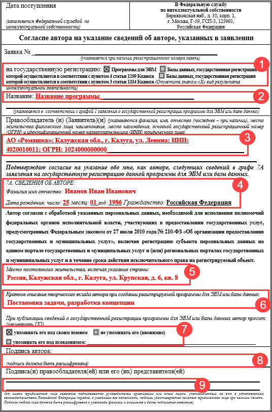
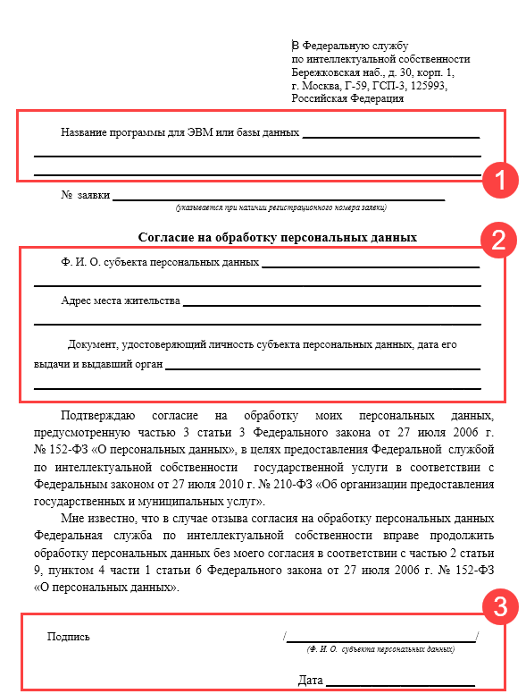

# Общая информация

# Регистрация в личном кабинете

Заявку на регистрацию в реестре программ для ЭВМ удобнее всего подавать через [личный кабинет](https://new.fips.ru/office/). 

При  регистрации в личном кабинете укажите следующие данные:

- Ф.И.О. — фамилия, имя и отчество директора организации, которая является правообладателем и заявителем.
- E-mail — действующий адрес электронной почты, на который будут направлены логин и пароль а также будут поступать уведомления об изменении статусов регистрации.
- СНИЛС — действующий страховой номер индивидуального лицевого счета руководителя. 

# Подготовка материалов

Для подачи заявки потребуются следующие документы:

- реферат;
- согласие автора на указание сведений;
- согласие автора на обработку персональных данных;
- документ, подтверждающий оплату государственной пошлины;
- депонируемые материалы.

## Реферат

Шаблон реферата доступен по [ссылке](https://disk.yandex.ru/i/cwXA5DUmd7xeaQ). Реферат должен содержать:

- Авторы — укажите Ф.И.О. всех авторов программы.
- Правообладатель — укажите организационно-правовую форму и наименование юридического лица, которое является правообладателем программы.
- Программа — укажите наименование программы. По завершении регистрации именно на данное наименование будут зарегистрированы исключительные права.
- Аннотация — укажите несколько абзацев описания функциональных возможностей программы.
- Тип ЭВМ — укажите типа устройств, на которых функционирует программа. Если программа запускается в браузере, то допустимо указать все возможные типа ЭВМ с поддержкой браузеров — персональный компьютер, сервер, мобильные устройства.
- Язык — укажите языки программирования, которые использовались при написании кода программы. 
- ОС — укажите операционные системы и их версии, в среде которых программа функционирует.
- Объем программы — укажите суммарный объем всех файлов программы после их сборки.

После заполнения реферата сохраните его в формате `PDF`.

## Согласие автора на указание сведений

Шаблон согласия автора на указание сведений об авторе доступен по [ссылке](https://yadi.sk/i/7doPs-1aW9rKVQ). Для каждого автора требуется подготовить отдельное согласие.

Вид документа:

Согласие автора на указание сведений об авторе должно содержать:

| №    | Тип данных                                   | Описание                                                     |
| ---- | -------------------------------------------- | ------------------------------------------------------------ |
| 1    | Вид результата интеллектуальной деятельности | Установите `x` в соответствующее поле. В случае регистрации программы для ЭВМ наименование поля: **Программы для ЭВМ**. |
| 2    | Название                                     | Укажите наименование программы. По завершении регистрации именно на данное наименование будут зарегистрированы исключительные права. |
| 3    | Правообладатель                              | Укажите наименование организации, адрес регистрации, ИНН, ОГРН правообладателя. |
| 4    | Сведения об авторе                           | Укажите Ф.И.О. автора, его дату рождения и гражданство.      |
| 5    | Место постоянного жительства                 | Укажите страну, область, город, улицу, дом и квартиру автора. |
| 6    | Краткое описание творческого вклада          | Укажите задачи, которые выполнял автор в процессе разработки, например: постановка задачи, разработка концепции и технического задания, проектирование и реализация архитектуры основных компонентов системы, разработка и реализация логики функционирования компонентов системы. |
| 7    | Упоминание                                   | Укажите способ упоминания автора: под своим именем, анонимно или псевдоним. |
| 8    | Подпись автора                               | Укажите подпись и расшифровку автора. Даже если упоминаем автора анонимно. |
| 9    | Подпись правообладателя                      | Укажите подпись руководителя организации.                    |

Заполните, распечатайте, подпишите и отсканируйте подписанное согласие для подачи документов через личный кабинет.

## Согласие автора на обработку персональных данных

Шаблон согласия автора на обработку персональных данных доступен по [ссылке](https://yadi.sk/i/CxayIuiNuZJihg). Для каждого автора требуется подготовить отдельное согласие.

Вид документа:

Согласие автора на обработку персональных данных должно содержать:

| №    | Тип данных                                | Описание                                                     |
| ---- | ----------------------------------------- | ------------------------------------------------------------ |
| 1    | Название программы ля ЭВМ или базы данных | Укажите наименование программы. Название должно совпадать с соответствующим названием в  документе "Согласие автора на указание сведений" и реферате. |
| 2    | Ф.И.О. субъекта персональных данных       | Укажите фамилию, имя и отчество автора.                      |
|      | Адрес места жительства                    | Укажите место регистрации автора                             |
|      | Документ, удостоверяющий личность         | Укажите паспортные данные автора                             |
| 3    | Подпись                                   | Укажите подпись и расшифровку автора. Даже если упоминаем автора анонимно. |
|      | Дата                                      | Укажите дату подписания документа.                           |

Заполните, распечатайте, подпишите и отсканируйте подписанное согласие для подачи документов через личный кабинет.

## Оплата госпошлины

Реквизиты для уплаты государственной пошлины доступны в документе по [ссылке](https://yadi.sk/i/DU4x56HZwDcVDw).

Передайте их в бухгалтерию для оплаты. 

При регистрации программы для ЭВМ или базы данных уплачивается государственная пошлина. КБК начинается с 168108. КБК, который начинается с 168115, необходимо указывать при уплате патентных пошлин. Патентные пошлины не относятся к регистрации программ для ЭВМ или баз данных!

## Подготовка депонируемых материалов

Подготовьте программный код для депонирования в виде PDF-документа. Состав кода должен позволить идентифицировать программу для ЭВМ, в случае возникновения спорных ситуаций, связанных с правообладателем. Весь код передавать не обязательно, ограничение - 40 страниц формата А4. Можно меньше.

